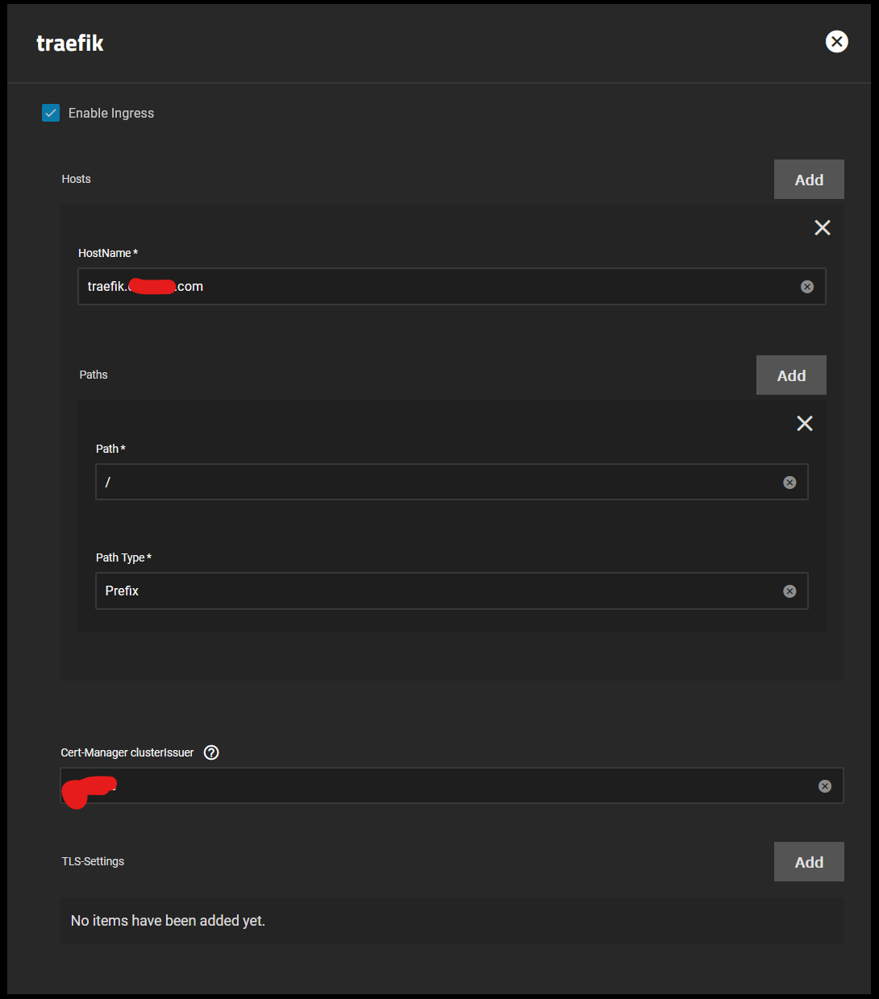

# clusterissuer Setup Guide

This guide will walk you through setting up `clusterissuer`, certificate management for Kubernetes.

## Prerequisites

Ensure you have the `enterprise` train enabled for `TrueCharts` as discussed [here](https://truecharts.org/manual/SCALE/guides/getting-started/#adding-truecharts).

Ensure you have traefik installed, required for Ingress.

Search for clusterissuer in the `Apps` menu | `Available Applications` tab and click **Install**.

## Cloudflare DNS-Provider

You can setup multiple domains with a single `clusterissuer` app, all you have to do is either add the global API key (**not recommended**) or `Add` multiple `ACME Issuer` entries for each domain and create an API token for each at [Cloudflare API Tokens](https://dash.cloudflare.com/profile/api-tokens).

- Give the certificate a name (eg domain or "maincert", etc).
- Select the correct provider, for example `Cloudflare`.
- Set **Server** to **Letsencrypt-Production**.
- Set Email to the account email.
- Optionally set Cloudflare API key (**not recommended**)
- Set the Cloudflare API Token to the one created earlier.

## clusterissuer App

:::note

It is by design that the app does not run, there are no events, no logs and no shell.

:::

## How to Add Ingress to Apps with clusterissuer

Here's an example on how to add ingress to an app with clusterissuer for a single domain only.

Add the name of the `ACME Issuer` into `Cert-Manager clusterIssuer`

:::warning

Do **NOT** use this combined with the `TLS-Settings`.

:::

If you want to support multiple domains, use the `TLS-Settings` option to create each one, basically an extra step each time.

## Verifying clusterissuer is working

Once installed using the Ingress settings above, you can see the `Application Events` for the app in question to pull the certificate and issue the challenge directly. See the example below:

All is automated by `clusterissuer`
