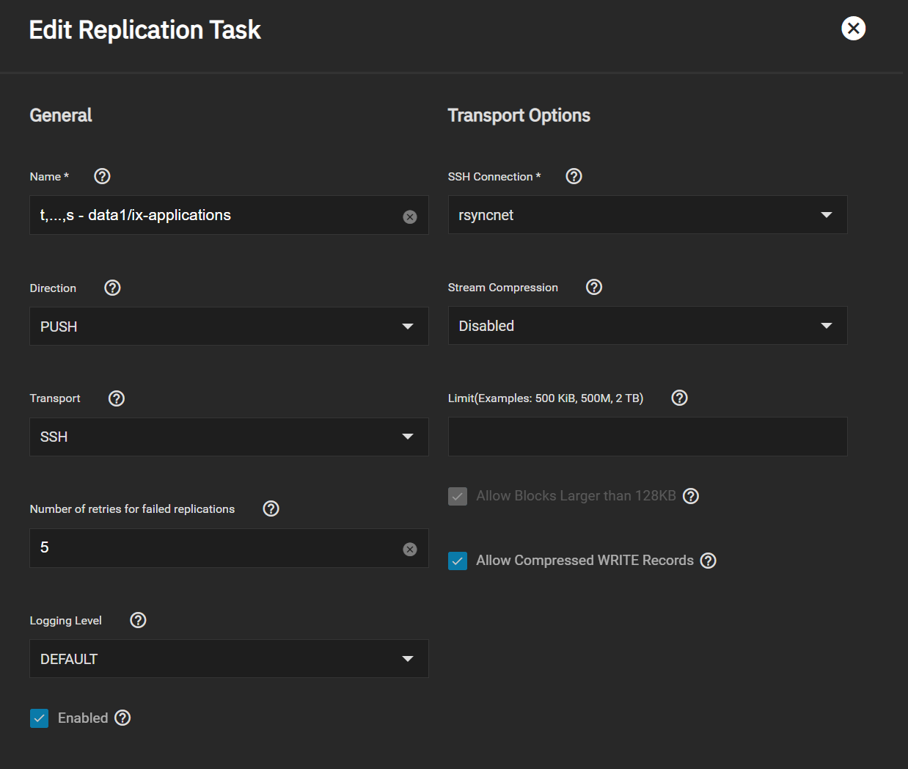
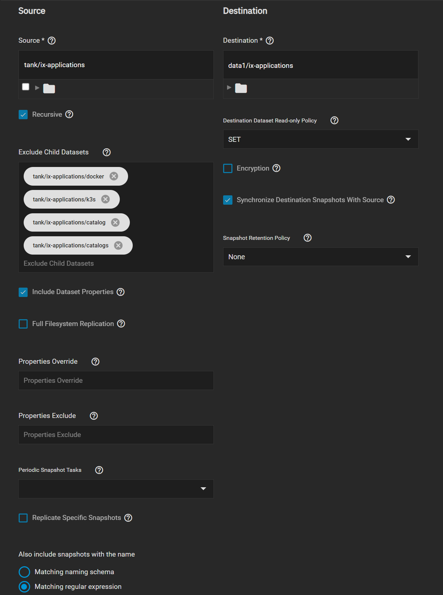
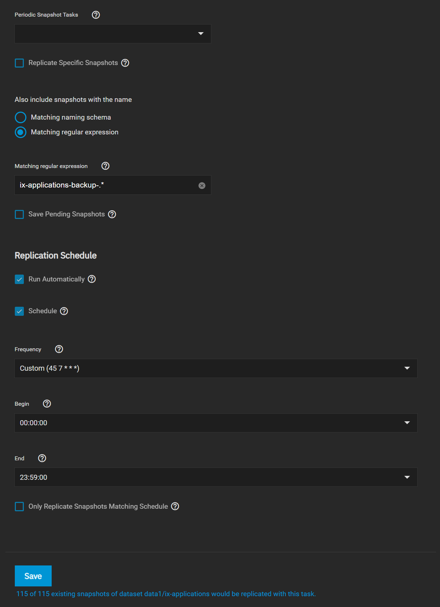

# Backup, Migrations and Restore

:::caution Best Effort Policy

This guide has been written with the best efforts of the staff and tested as best possible. We are not responsible if it doesn't work for every scenario or user situation. 
This guide has been thoroughly tested with TrueNAS SCALE 22.02.4.

:::

## Requirements

This guide makes use of our command-line tool, called `TrueTool` and assumes you've already created backups using the BASH TrueTool.

Please refer to the GitHub page for [Truetool](https://github.com/truecharts/truetool) to follow the commands and instructions below. 

## Backup


### Exporting Backups

The above only creates only a backup of the kubernetes objects and a snapshot of the `PVC` and `ix_volume` storage.
These backups are saved under the same ix_applications dataset.

It does not protect these against, for example, deletion of datasets or save them on an external system.

We **highly** advice making both an internal backup (separate dataset on the same system) *and* an offsite backup.
One could create a normal recursive(!) replication of the `ix-volumes` dataset using the SCALE GUI, with the following few special tricks by editing the replication after creation:

To do so, setup the following replication task:





It's also important to ensure you keep regular config backups of the SCALE system itself, preferably right after the Apps backup above).
However this is not part of this guide and we will assume you've done so yourself.

### Checking Backups

To make which backups are present, one can use `truetool` command and select the 3rd option to get a list of backups


Which results in


## Restore

One of the most important parts of backups is to ensure they can be restored.
There are two scenario's for a restore:

1. Reverting a working system

2. Total System Restore

### Reverting a running system

Reverting a running system is rather trivial. But there are a few caveats:

- This will reinitialize the kubernetes node, which means all kubernetes objects that are not deployed using the Apps system will get reverted
- You CANNOT revert a single Apps

To revert an existing system, the process is as follows:

1. List your current backups using `truetool`

2. Select option 5 `Restore a Backup`

3. Choose Backup and answer the prompt


Please keep in mind this can take a LONG time, so be sure to wait a few hours before touching the system again.
When done, a reboot might be adviceable

### Total System restore and Migration to new system

>Sometimes you either need to wipe your system, Migrate to a new system or restore a system completely.
With the steps below, this is all very-much-possible.

:::caution Ensure a Clean system

- Ensure a clean system, without Apps or configuration except the bare minimum network configuration
- Do not choose an apps pool yet, or do ANYTHING with apps until step 3
- Please do not restore SCALE configuration from backup-file, before Apps pool replication is finished.

:::


1. Using ZFS replication, move back the previously backed-up `ix-applications` dataset to the disk that will contain the future Apps Pool. This was covered in the [Exporting Backups](#exporting-backups) section.

2. _Optional/untested_: When the SCALE system itself is also wiped, ensure to restore it using a SCALE config export **first**.

3. Once the ZFS replication is complete, on the new or migrated system navigate to the __Apps__ tab in the Truenas Scale GUI. When prompted to select a pool, select the pool containing the `ix-applications` dataset.

4. All you need to do now is restore the Truetool snapshot of your `ix-applications` dataset by following the [Reverting a running system](#reverting-a-running-system) guide above.

## Video Guide

TBD

## Developer notes

### PVC mountpoints on replication

In some/all cases PVC mountpoints are not correctly set to `legacy` after replication.
Both TrueTool and Heavyscript have added scripting to fix this issue, however it does not seem to be a priority for iX-Systems to fix upstream.
To fix this issue manually, run:
>
```bash
zfs set mountpoint=legacy "$(zfs list -t filesystem -r "$(cli -c 'app kubernetes config' | grep -E "pool\s\|" | awk -F '|' '{print $3}' | tr -d " \t\n\r")" -o name -H | grep "volumes/pvc")" 
```

Jira Ticket:
https://ixsystems.atlassian.net/browse/NAS-118570
