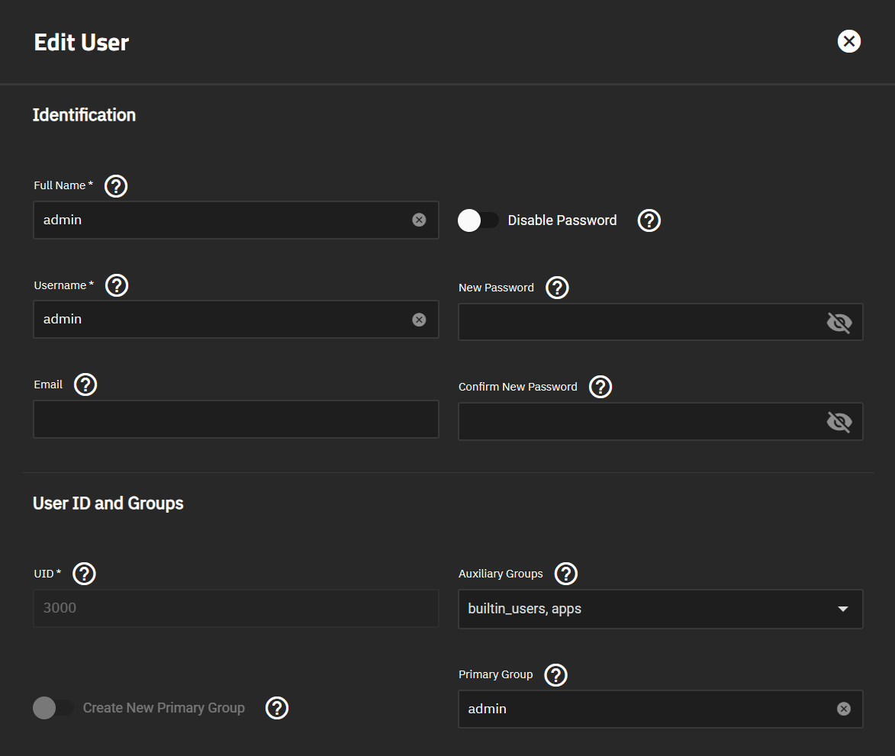
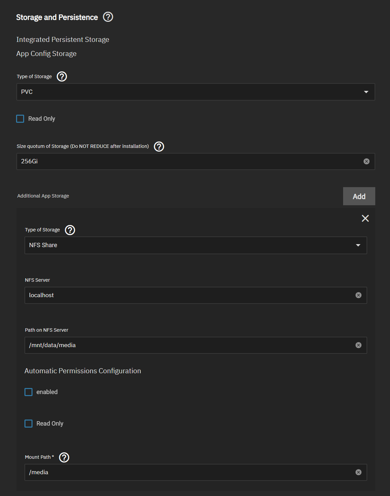

# Dataset and Share Setup Guide

This guide provides the recommended setup for dataset permissions, shares and application data storage.

## Dataset Permissions

TrueCharts applications are designed to use the `apps` (568) user for data permissions. Configure your dataset permissions as shown below to allows applications access.

:::info ACL

If your existing dataset shows `Edit ACL` then you need to `Strip ACL` before continuing.

:::


## SMB Access

For SMB access you will need to create a user(s) that are members of the `apps` group and modify the default SMB settings. 

### SMB User

Create a user and assign it to the `apps` group under `Auxiliary Groups` as shown below.



### SMB Share

Create an SMB Share as shown below. All settings should remain default except for `Auxiliary Parameters`.

:::warning ACL

After saving SMB settings TrueNAS Scale will launch an `Edit ACL` screen. Do **NOT** `Save Access Control List` as this will overwrite the previously configured permissions. You can make any selection from the TrueNAS GUI to exit this screen, SMB Share will still be configured.

:::


```bash
force user=apps
force group=apps
```

## NFS Share

Create an NFS Share which will be used for applications to access the dataset. Configure an NFS Share as shown below. All settings should remain default.


## App Storage

For most applications data access will be configured under `Additional App Storage`.

:::caution APP CONFIG STORAGE

NFS should **NOT** be used for `App Config Storage`. This should be left on the default of PVC.

:::

Configure `Additional App Storage` as shown below. In some applications data storage is part of the application configuration, in those cases you would still configure NFS but not need to setup a `Mount Path`.



