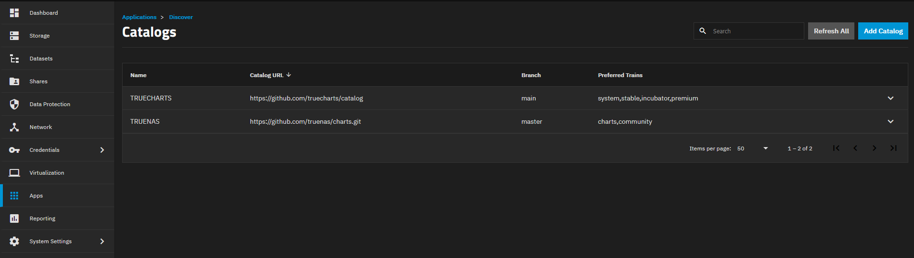
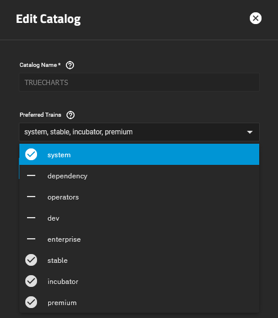

# Storage Configuration on SCALE 24.04 DragonFish

:::caution DragonFish is not yet supported

This is a pre-release guide, TrueNAS SCALE 24.04 DragonFish is explicitly **NOT** yet supported by TrueCharts

:::

## Important Changes

iX-Systems no longer maintains or supports any form of PVC-based storage for apps. This includes their own "legacy" storage backend. This means that when using the following SCALE features, you will lose some functionality:

**SCALE Backup and Restore (unreleased feature available through HeavyScript)**

*Will no longer back up storage at all.*

**SCALE Rollback**

*You will no longer be able to roll back any storage.*

**SCALE App pool migration**

*You will no longer be able to migrate storage using the pool migration feature in SCALE.*

The above issues exist both for our new in-house TrueCharts OpenEBS storage solution **and** for users using already installed apps that use the legacy storage backend from iX-Systems.

## For existing Users and Apps

### Pre-Dragonfish Upgrade Steps

Before upgrading to TrueNAS SCALE 24.04 "DragonFish", you **must** execute the following steps on each TrueCharts App installed on your SCALE system:

- Edit the App

- Locate the Storage and Persistence section

- If the type of storage is set to "PVC", ensure the "storageClass" value that is likely currently empty is set to "SCALE-ZFS" per our news post [here](https://truecharts.org/news/small-scale-changes/#pre-dragonfish-storage)
- Update/Save the edited app

- Proceed with updating SCALE to DragonFish

### Post-DragonFish Upgrade Steps

Once you have completed updating your SCALE system to DragonFish, enter the following command in the TrueNAS SCALE shell ensuring it's ran as root and as shown below:

`k3s kubectl delete storageClass openebs-zfspv-default`

### Further Post-DragonFish Upgrade Steps

Once you have completed the above steps, you need to install the `OpenEBS` app from the TrueCharts Operator train as below. This app contains our own version of PVC storage.

- In the SCALE GUI, go to Apps -> Discover Apps -> Manage Catalogs
- Ensure you have `operators` in the list of Preferred Trains in the TRUECHARTS row as below. If so, skip the next step

- If you don't already, you can add it by selecting the TRUECHARTS row and selecting the `Edit` button and selecting `operators` under the "Preferred Trains" dropdown list as below

It's important to set the `basePath` to the location you want to store the folders with the application data in them.

:::danger

When setting the `basePath` as above, do **not** set the path to the existing ix-applications dataset.

:::

When the upgrade is done you will now have two types of storage:

#### "Legacy" storage

This is hidden in hidden datasets under `ix-applications`. This is **only** available for Apps that were installed prior to upgrading SCALE to DragonFish. This **can** still be mounted using HeavyScript.

#### New Storage Managed by TrueCharts

This storage is based on "folders" and not "datasets". This means the data is freely accessible via the host shell, shares and via SSH. The folders are stored in the `basePath` path you entered above.

Folders are, however, still using randomised names and are **not** intended to be user-servicable. If a situation arises where the folders are needed to be accessed by the user, HeavyScript is no longer required to do this.

## For new Users and Apps freshly installed on DragonFish

- Install the App `OpenEBS` from the Operator train using the instructions in the steps above. This contains our own version of PVC storage.
- As above, it's important to set the `basePath` to the location you want to store the folders with the application data in them.

All of your application data set to "PVC" will now be stored under the `basePath` path you set above.

## Future Changes

Future versions of TrueNAS SCALE **and** TrueCharts will remove support for legacy storage **completely**.

### Migrating to new storage

We highly advise moving to the new storage backend for existing Apps as well. *At a later date we will update this with migration instructions as well.*
