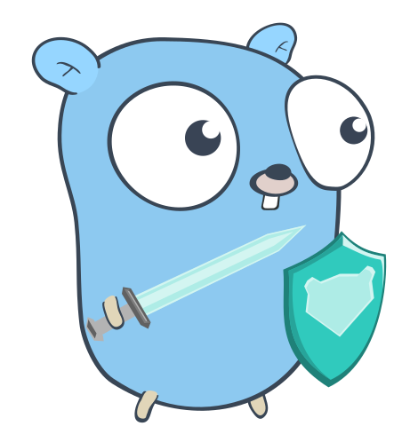

# Getting Started with TrueCharts inside TrueNAS SCALE

Below you'll find recommended steps to go from a blank or fresh TrueNAS SCALE installation to using TrueCharts with the best possible experience and performance as determined by the TrueCharts team. This is an overview with links to specific apps and/or other guides but will help you get started if you haven't used any TrueCharts before. It does not replace the application specific guides and/or specific guides on certain subjects (PVCs, VPN, linking apps, etc) either, so please continue to check the app specific documentation and the TrueNAS SCALE specific guides we've provided on this website.

## Requirements

- TrueCharts apps share computing resources with your system. Please review our [recommended system requirements](https://truecharts.org/manual/systemrequirements).
- Your apps dataset needs to be large enough to store the containers, configuration files, snapshots, and other persistent volume (PVC) data. You can always configure [additional storage](https://truecharts.org/manual/SCALE/guides/add-storage) using HDD pools (e.g. downloads folder) for specific apps later.
- Make sure your SCALE installation has a working storage pool that you'd like to use for TrueCharts. [Read more](https://www.truenas.com/docs/scale/scaletutorials/storage/) in the SCALE tutorial.
- Make sure you have a working Internet connection and can reach `https://github.com`, `https://truecharts.org`, and `https://tccr.io` from the host system.
- Ensure your system time is up to date and you've chosen your preferred timezone in your [SCALE settings](https://www.truenas.com/docs/scale/scaleuireference/systemsettings/generalsettingsscreens/#localization). Apps you install will default to this timezone.

### Configuring Your App Pool

Your Apps pool must be configured before adding TrueCharts. When opening the Apps menu item on SCALE for the first time, you'll be prompted to [choose a storage pool](https://www.truenas.com/docs/scale/scaleuireference/apps/appsscreensscale/) for your Apps. If more info is needed about `TrueNAS SCALE` please check out our [introduction to SCALE](https://truecharts.org/manual/SCALE/guides/scale-intro) page.

After creating your Apps pool, you'll be able to add the TrueCharts Community Catalog.

## Adding TrueCharts

To add TrueCharts to your SCALE installation:

 1. Go to **Apps** page from the top level SCALE menu
 2. Select **Manage Catalogs** tab on the Apps page
 3. Click **Add Catalog**
 4. After reading the iXsystems notice, click **Continue** and enter the required information:
 Name: `truecharts`
 Repository: `https://github.com/truecharts/catalog`
 Preferred Trains: `enterprise`,`stable` and `operators` (type each one manually)
 Branch: `main`
 5. Click **Save** and allow SCALE to refresh its catalog with TrueCharts (this may take a few minutes)

Please view this video from the TrueNAS documentation webiste on adding [3rd party catalogs](https://www.truenas.com/docs/scale/scaleuireference/apps/appsscreensscale/#add-catalog) if you need more info on the process.

:::info Introduction to TrueNAS SCALE Guide

Please free to check out our [Introduction to TrueNAS SCALE](https://truecharts.org/manual/SCALE/guides/scale-intro) guide on some specific information on installing, editing, rollbacks and CLI commands for use with apps on TrueNAS SCALE.

:::

### TrueCharts Trains Overview

TrueCharts has multiple "trains", or branches of apps which you can choose to install. Below is a summary of each train and its intended use.

- `stable` contains apps which have been thoroughly tested and expected to be stable and working. The `stable` version of an app is always the best available version.
- `incubator` contains apps which are still in development and/or are not considered to be stable and working well enough to be moved into the `stable` branch.
- `dependency` contains apps that are mostly used as dependencies. This train is not supported, aside from bug fixes.
- `enterprise` contains apps for core TrueCharts features and, in the future, will be covered by additional support for professional use cases.
- `operators` contains operators for certain apps and may be required for specific apps to function at all, recommended leaving this `enabled`

[See here](https://truecharts.org/charts/description_list) for a list of all apps available for each TrueCharts trains.

## Heavyscript

We also recommend installing [Heavyscript](https://github.com/Heavybullets8/heavy_script) once you've added the TrueCharts catalog as well. It's a bash script for managing Truenas SCALE applications, automatically update applications, backup applications datasets, open a shell for containers, and many other features. Please visit the [Heavyscript GitHub Page](https://github.com/Heavybullets8/heavy_script) for more info.

## MetalLB installation and disabling integrated LoadBalancer

This step may be optional but is recommended for advanced users and/or those who which to assign specific IPs to their SCALE applications. We have a full guide explaining the setups on the [MetalLB-Config Setup Guide](https://truecharts.org/charts/enterprise/metallb-config/setup-guide) page on how to setup MetalLB and disable the integrated Loadbalancer. Please refer to that page for more info

## CNPG and Prometheus Operators installation and migration guide for older users

 

Many of our popular apps for TrueNAS SCALE use CloudNativePG or CNPG for short and will require the `Cloudnative-PG Operator` and `Prometheus Operator` to be installed **PRIOR** to installing an app using CNPG. That's why if you are unsure if you're using any apps with CNPG we advise users to install the `Cloudnative-PG`/`Prometheus` operators first before attempting to install apps. Please see the [CNPG Migration Guide](https://truecharts.org/manual/SCALE/guides/cnpg-migration-guide) for steps on installing this Operator and migrating for those not using the CNPG operator. As well, see this [News artcile](https://truecharts.org/news#prometheus) on removing the old built-in prometheus operator

## Cert-Manager (operator) and Clusterissuer installation for certificate management

TrueCharts only supports the usage of `Cert-Manager` (both the operator portion and the main `clusterissuer`) for certificate management inside apps for TrueNAS SCALE. The usage of TrueNAS SCALE certificates through the GUI is `deprecated` and may cease to function in future updates. We highly recommend setting up `clusterissuer` using our [clusterissuer setup-guide](https://truecharts.org/charts/enterprise/clusterissuer/how-to) before adding `Ingress` to you applications.

## Blocky DNS provider for split-DNS installation and guide

Blocky is the preferred DNS solution for TrueCharts, it's a DNS proxy, DNS enhancer and ad-blocker which supports "split-DNS" through `K8S-Gateway` and is highly-available. The [BlockySetup-Guide](https://truecharts.org/charts/enterprise/blocky/setup-guide) will cover basic setup options which will get you up and running and is not all inclusive.

## Traefik installation for Ingress / Reverse-Proxy support with TrueCharts Apps

`Traefik`, our `ingress` or `reverse-proxy` solution of choice, is integrated into all our apps in order to make it as easy as possible to secure your Apps. To support this, we supply a separate Traefik "ingress" app, which has been pre-configured to provide secure and fast connections. Please check the `Traefik` [How-To](https://truecharts.org/charts/enterprise/traefik/how-to) for basic instructions and a video as well.

## Authelia Installation

Authelia is a Single Sign-On Multi-Factor portal for web apps, and is the `preferred` solution to secure your TrueCharts apps when exposing them using `Traefik` as your ingress solution. We have a detailed guide that goes through setting up `Authelia`, along with `LLDAP` as a backend for `Authelia` and setting up the `forwardAuth` section of `Traefik` to handle the redirections and securing your apps. Please refer to the [Authelia Setup-Guide](https://truecharts.org/charts/enterprise/authelia/Setup-Guide) for more info.

### Video Guide

<iframe width="560" height="315" src="https://www.youtube.com/embed/Vomm8uvdCM0" title="YouTube video player" frameBorder="0" allow="accelerometer; autoplay; clipboard-write; encrypted-media; gyroscope; picture-in-picture" allowFullScreen></iframe>
