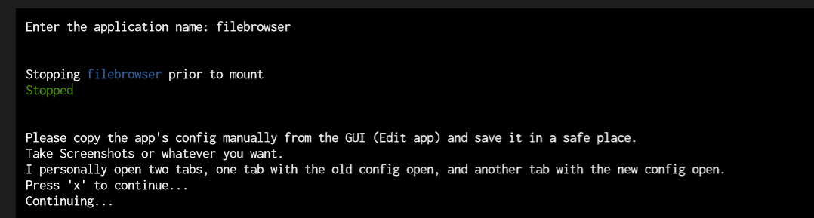
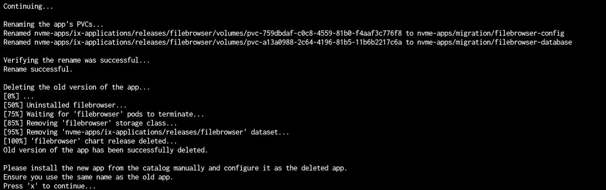
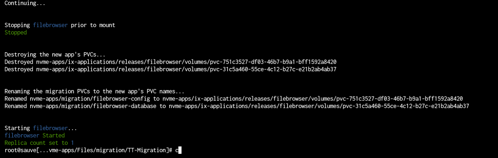

# PVC Migration Script

**Credit**

This guide uses the [HeavyBullets Migration Guide for PVCs](https://github.com/Heavybullets8/TT-Migration) so credit for this one goes there, also to [Zasx](https://github.com/ZasX) from the [TrueCharts](https://www.truecharts.org) team for the steps used to create these guides/scripts

## Warnings

**Note:** This will *not* be sufficient for apps that have a PostgreSQL database that were updated to the new CNPG common, Please see the more extensive guide for those apps. As well the script will exclude apps with database pods so those will have to be done manually or using our more extensive [PVC Migration Guide with Postgres support](https://truecharts.org/manual/SCALE/guides/migration-pvc/) guide.

**Note:** Make sure you have a Heavyscript backup *and* a replication of this backup.

:::warning

Really make sure you have a backup/replication ready in case something goes wrong or you delete a PVC too quickly

:::

Anything that doesn't have a database *should* succeed. Here's an incomplete list of tested apps:

`adguard-home`
`audiobookshelf`
`autoscan`
`bazarr`
`calibre`
`code-server`
`Custom-app Apps`
`deluge`
`emulatorjs`
`fileflows`
`filebrowser`
`flaresolverr`
`freshrss`
`heimdall`
`homarr`
`homepage`
`jellyfin`
`jellyseerr`
`Komga`
`mkvcleaver`
`mymediaforalexa`
`mysql-workbench`
`organizr`
`overseerr`
`phpldapadmin`
`plex`
`podgrab`
`prowlarr`
`qBittorrent`
`radarr`
`readarr`
`recyclarr`
`sabnzb`
`scrutiny`
`sonarr`
`syncthing`
`tautulli`
`transmission`
`unifi`
`unpackerr`
`uptime-kuma`

:::warning Not Working

This script does **not** work with Prometheus, so please follow our more extensive [PVC Migration Guide with Postgres support](https://truecharts.org/manual/SCALE/guides/migration-pvc/) guide.

:::

## Migration Steps

1. Clone the `Heavybullets TT Migration Git Repo`

```bash
git clone https://github.com/Heavybullets8/TT-Migration.git
```

2. Go to the `TT-Migration` sub-directory and excute

```bash
bash migrate.sh
```

3. Follow prompts 

    a. Choose Application (for example `filebrowser`)


    b. Once that's done press `x` and continue to the next screen and install the new Application


    c. Watch the app finish
    

4. Enjoy new app

### Note

If an application fails to stop the NEW application, and throws any errors. You can attempt to run the script again, with:

```bash
bash migrate.sh -s
```

which will skip to the step immediately after deleting the old application.
