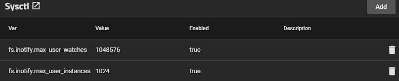

# Setting Inotify in Scale

Setting the inotify settings in scale can help assist with some app deployment issues and performance problems
it should be noted this is not a magic fix all

  **Check your Current Values you can do this with the following**
  

    cat /proc/sys/fs/inotify/max_user_watches
    cat /proc/sys/fs/inotify/max_user_instances

 By default on Scale BlueFin these will likely return  8129 and 128 Respectively, this will be to low for most users. 
 You Can Change these values in system 

system settings > advanced Settings > sysctl section.

 It Should be noted that adjusting these values will slightly increase ram usage.
 Good Values to staart with would be
 fs.inotify.max_user_watches = 524288
 fs.inotify.max_user_instances = 512

**Example**

