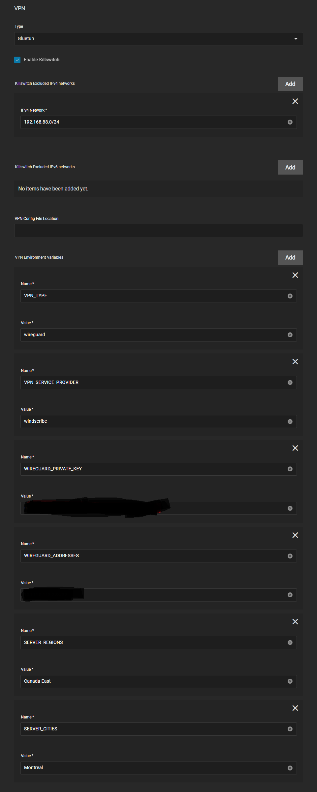
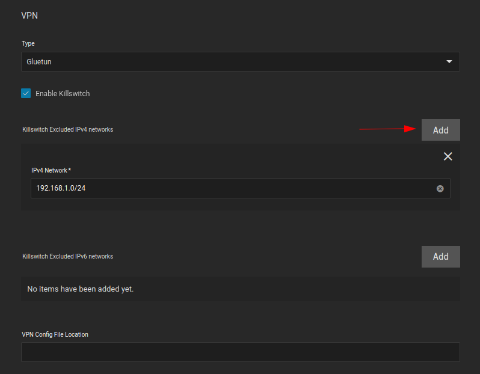
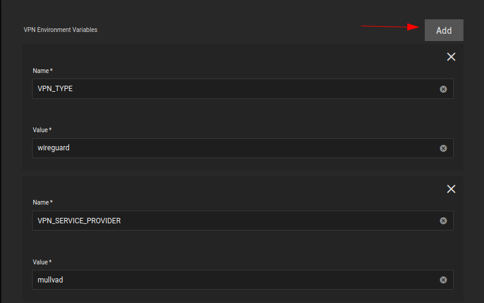
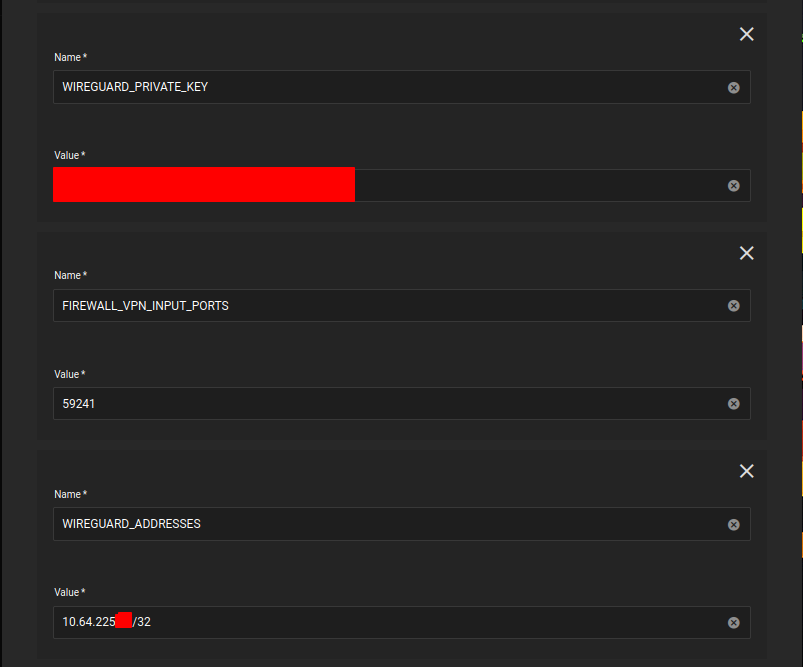
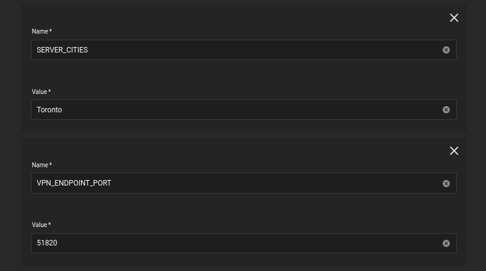

# Gluetun VPN Add-on Setup Guide

Basic setup of the TrueCharts [Gluetun](https://github.com/qdm12/gluetun/) VPN addon

## Prerequisites

- Anything migrated to the new common chart that features Gluetun
- Ideally a VPN provider supported by Gluetun, check the [Wiki](https://github.com/qdm12/gluetun/wiki) on the [Gluetun](https://github.com/qdm12/gluetun/) site for more info. There are custom providers but that is beyond the scope of this guide.

## Gluetun VPN Addon Setup

- Install app as per usual and scroll down the to the `Addons` section
- Click on `VPN` and select `Gluetun`

`Gluetun` works with Environment Variables so we need to configure them below. Enter your `VPN Provider` specific ones (see blow)

### OpenVPN Example

- All providers will generally need `VPN_SERVICE_PROVIDER` and `VPN_TYPE`, for me it's `Windscribe` and `openvpn` but I could easily choose `Wireguard`
- Scroll to the [Gluetun Wiki](https://github.com/qdm12/gluetun/wiki) and find your specific provider and enter their info, eg [Windscribe Wiki Page](
https://github.com/qdm12/gluetun/wiki/Windscribe)

### Wireguard Example

I will demonstrate using 'Mullvad' as the provider.

- I pull my private key, endpoint port and Wireguard Addresses from a Mullvad wireguard config file.
  
- You can generate a new config file from the Mullvad website, here is the [Mullvad Config Generator](https://mullvad.net/en/account/#/wireguard-config/)

Now we can enter the Env Vars

- Install app as per usual and scroll down the to the `Addons` section, click `Add` for each new environment variable
  
- Enable the killswitch by ticking `Enable Killswitch` box
- Click `Add` for every subnet you would like to exclude from the VPN tunnel. I have added my local subnet.
  > Specifying the kubernetes subnet is not necessary as it is automatically excluded from the VPN tunnel
- VPN Config File Location is not necessary, we will be using environment variables instead, so leave it blank

- `VPN_TYPE` is `wireguard`
- `VPN_SERVICE_PROVIDER` is `mullvad` in my case

- `WIREGUARD_PRIVATE_KEY` is the private key from the Mullvad config file above
- `FIREWALL_VPN_INPUT_PORTS` is the *port forward* port, to forward a port with Mullvad, follow steps 2 and 3 from here: [Mullvad Port Forwarding](https://mullvad.net/en/help/port-forwarding-and-mullvad/)
- `WIREGUARD_ADDRESSES` is the Mullvad endpoint IP address, found in the Mullvad config file above

- `SERVER_CITIES` is the Mullvad server city, it should likely be in from the same city your config file is from, and should share the same city as your forwarded port. In my case, I am using the `Toronto` server city, and my forwarded port is from `Toronto`.
- `VPN_ENDPOINT_PORT` is the Mullvad endpoint port, found in the Mullvad config file above

## Verify it works

Easiest way to verify after it deploys (the app will fail if your credentials don't work) for me is using `qbittorrent` since the network page shows the interfaces can be shown quickly (or check the logs), `tun0` for `OpenVPN` or `wg0` for `Wireguard`.

- Basically same as above but needs the `VPN_TYPE` switched to `wireguard`, `WIREGUARD_PRIVATE_KEY` and `WIREGUARD_ADDRESSES`

Easiest way to verify after it deploys (the app will fail if your credentials don't work) for me is using `qbittorrent` since the network page shows the interfaces can be shown quickly (or check the logs), `tun0` for `OpenVPN` or `wg0` for `Wireguard`.

