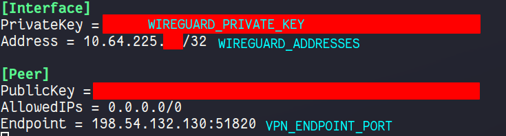

# Gluetun VPN Add-on Setup Guide

Basic setup of the TrueCharts [Gluetun](https://github.com/qdm12/gluetun/) VPN addon

## Prerequisites

- Anything migrated to the new common chart that features Gluetun
- Ideally a VPN provider supported by Gluetun, check the [Wiki](https://github.com/qdm12/gluetun/wiki) on the [Gluetun](https://github.com/qdm12/gluetun/) site for more info. There are custom providers but that is beyond the scope of this guide.

## Gluetun VPN Addon Setup

- Install app as per usual and scroll down the to the `Addons` section
- Click on `VPN` and select `Gluetun`

`Gluetun` works with Environment Variables so we need to configure them below. Enter your `VPN Provider` specific ones (see blow)

### OpenVPN Example

- All providers will generally need `VPN_SERVICE_PROVIDER` and `VPN_TYPE`, for me it's `Windscribe` and `openvpn` but I could easily choose `Wireguard`
- Scroll to the [Gluetun Wiki](https://github.com/qdm12/gluetun/wiki) and find your specific provider and enter their info, eg [Windscribe Wiki Page](
https://github.com/qdm12/gluetun/wiki/Windscribe)

### Wireguard Example

- Basically same as above but needs the `VPN_TYPE` switched to `wireguard`, `WIREGUARD_PRIVATE_KEY` and `WIREGUARD_ADDRESSES`
## Verify it works

Easiest way to verify after it deploys (the app will fail if your credentials don't work) for me is using `qbittorrent` since the network page shows the interfaces can be shown quickly (or check the logs), `tun0` for `OpenVPN` or `wg0` for `Wireguard`.

