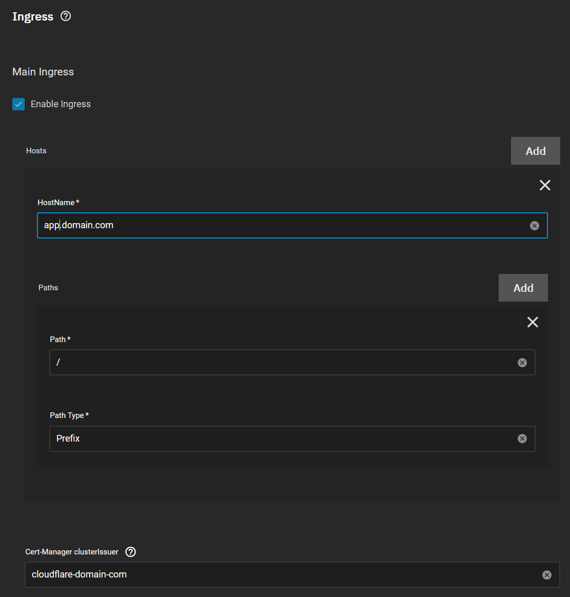
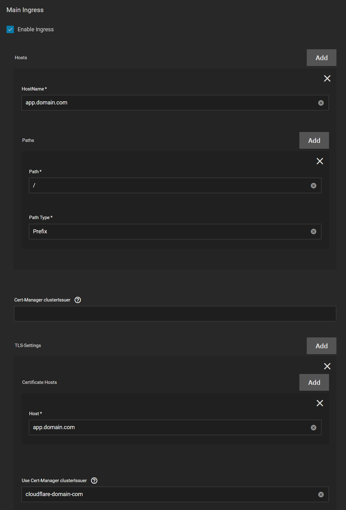
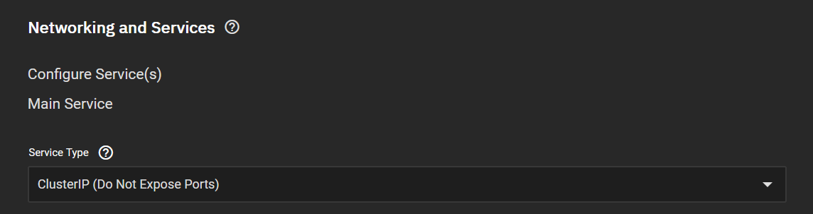

# Ingress

Ingress (more commonly known as Reverse Proxy) settings can be configured here. This is how Kubernetes connects your Applications in containers to FQDNs (fully qualified domain names). If you choose to enable this you must have a Reverse Proxy installed and a DNS service to resolve the DNS name of the FQDN specified.

:::caution Reverse Proxy support

Currently the `Reverse Proxy` of choice for `TrueCharts` is `Traefik`. Enabling `Ingress` will configure settings for use with the `Traefik` application. Other reverse proxies may be used, however these settings will not affect them and there will be no support from the `TrueCharts` team.

:::

## Requirements

- A working Internet connection that can reach github and truecharts.org from the host system.
- A configured Apps pool, ensure you selected your storage-pool when you first opened the "Apps" interface, if not please refer to [Adding TrueCharts to SCALE](/docs/manual/SCALE/guides/getting-started.md)
- You've added the TrueCharts catalog from [Adding TrueCharts to SCALE](/docs/manual/SCALE/guides/getting-started.md)
- cert-manager is installed (**recommended** for new common Apps), see [Installing cert-manager](/docs/charts/enterprise/cert-manager/how-to.md)
- Traefik is installed, see [Installing Traefik](/docs/charts/enterprise/traefik/how-to.md)

:::tip

Before enabling Ingress we recommend installing the App and ensure it's working first.

:::

## Main Ingress

To configure Ingress follow this step by step guide:

- Enable `Enable Ingress`
- `Hosts`
  - `HostName` (required): Enter your FQDN here (app.mydomain.com)
- `Paths` : Must have one but may have multiple paths.
  - `Path` (required): `/` is entered by default.
  - `Path Type` (required): `Prefix` is entered by default.

:::note

By default the hosts list is empty. This is due to upstream design choices and is an issue that is yet to be resolved upstream.
However, adding hosts (preferably just one) **is required** for an app to function with ingress enabled.

:::

:::caution

Apps may not install and throw errors if you do not add a host and path.

:::

### Certificate Settings

#### Single Domain

- `Cert-Manager clusterIssuer` : Enter the name of an ACME Issuer configured in cert-manager.

#### Multiple Domains

To support multiple domains, use the `TLS-Settings` option. Ensure `Cert-Manager clusterIssuer` is blank for the TLS-Settings to be displayed.

### Advanced Settings

- `Traefik Middlewares`: Any `Traefik` middlewares can be added here, see how to [Add Basic Auth to Apps](/docs/charts/enterprise/traefik/traefik-basicAuth-middleware.md) for an example of a Traefik middleware.

- `Add Manual Custom Ingresses` (expert): Enables advanced custom Ingress settings that may be used by expert users.

## Networking Main Service Type

:::note

We recommend that in `Networking and Services` that the `Service Type` for the `Main Service` is configured as ClusterIP. See [Networking and Services](/docs/manual/SCALE/options/networking.md) for further details.

:::

## Traefik Certificate Issues

Sometimes you might notice Traefik ignores your certificate. This is most likely due to the domain on your certificate being different from the domain you entered into the `HostName` entry.
Traefik requires your certificate to match the domain used for Ingress.
