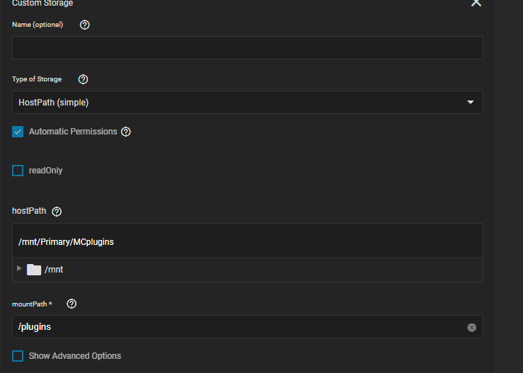

# Minecraft Java Community Guide

⚠️ **Warnung in dieser Anleitung enthält Informationen, die erweiterte /Experteneinstellungen verwenden. Infolgedessen wird dies außerhalb des Rahmens der Unterstützung liegen!**⚠️

---

## Mehrere MC-Java-Server laufen

Sie können auf einfache Weise mehrere MC Server ausführen. Sie müssen nur die externen Ports ändern, achten Sie darauf, dass Sie einen ungenutzten Port verwenden. Es gibt keine Notwendigkeit, den Minecraft-Port oder den RCON-Port in der server.properties zu ändern

MC-Server 1

MC-Server 2

## Plugin-DIR

Um Plugins einfach auf Ihren MC-Server zu bringen, da PVC's für den Konfigurationsspeicher verwendet werden, können Sie entweder /mods oder /plugins hinzufügen, je nachdem, was Ihr Server braucht.

Dies gibt dir einen einfachen Ordner um die Plugins zu löschen und sie werden dann mit /data/plugins oder /data/mods synchronisiert du solltest in die App einshellen, um alte Versionen regelmäßig aufzuräumen

## Plugins/Mods, die zusätzliche Ports benötigen

Verwenden Sie Dynmap als Beispiel Unter Netzwerk und Services Check Show Expert config (erinnern Sie sich an die Warnung oben?)

Klicken Sie auf Manuelle benutzerdefinierte Dienste konfigurieren und füllen Sie so aus, indem Sie zusätzliche Service-Ports konfigurieren

Für die zweite Serverinstanz ist das Setup ungefähr der selbe kleine Unterschied in der Notwendigkeit, den Port für dynmap im Container auf einen neuen Port zu wechseln und so zu konfigurieren (Beachten Sie, dass dies nur mein System aufgrund meiner Tests und nicht neustartet)

Dynmap Web funktioniert

