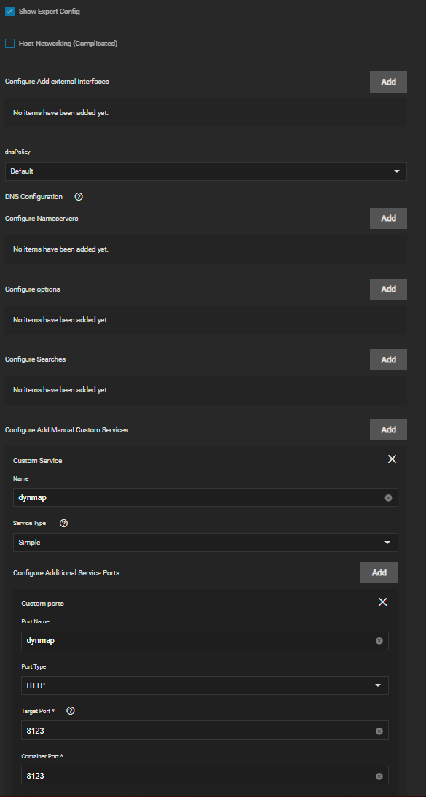
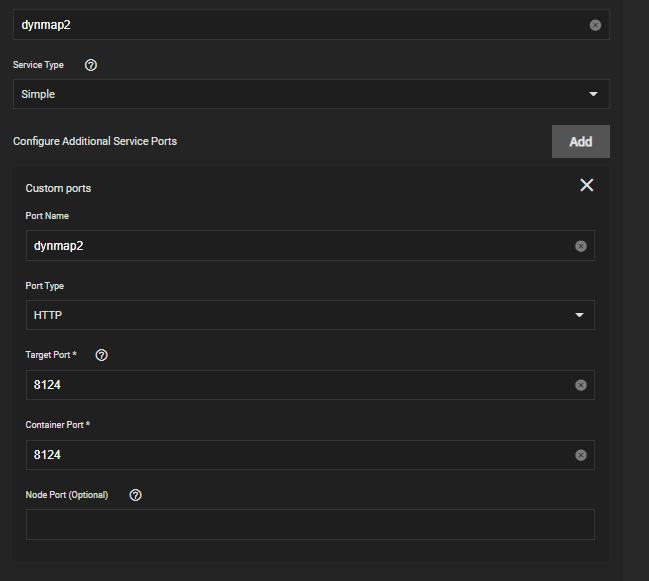
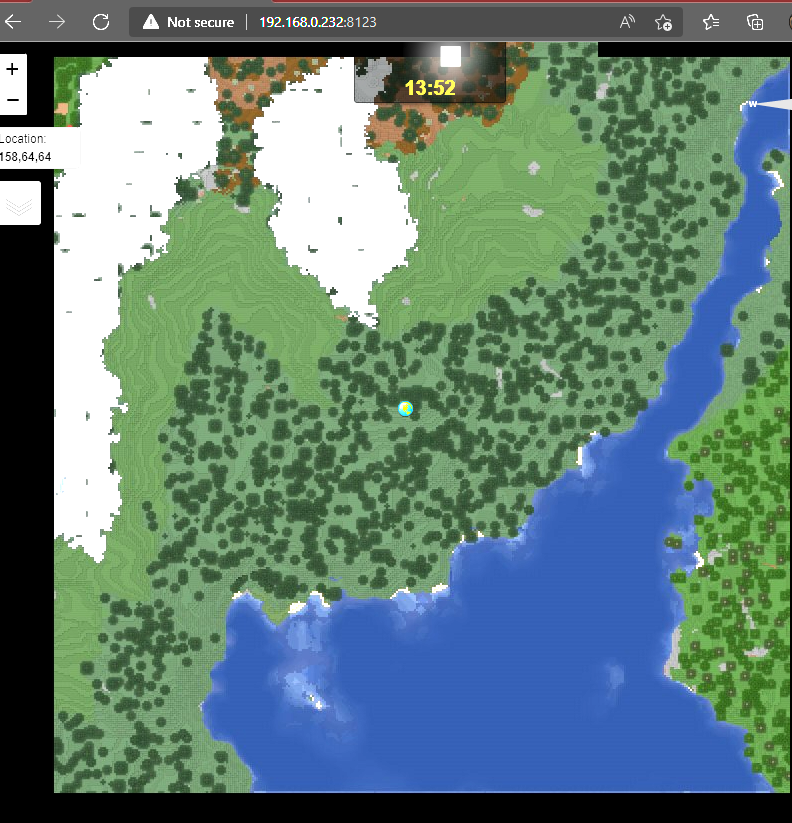

# Guía de comunidad de Minecraft de Java

⚠️ **Advertencia Esta guía contiene información que utiliza ajustes avanzados/expertos. ¡Como resultado, esto quedará fuera del ámbito de soporte!**⚠️

---

## Ejecutando múltiples servidores MC-Java

Puede ejecutar múltiples servidores MC fácilmente. Simplemente necesita cambiar los puertos externos, asegúrese de usar un puerto sin usar. No hay necesidad de cambiar el puerto de Minecraft o el puerto RCON en el server.properties

Servidor MC 1

Servidor MC 2

## DIR Plugins

Para conseguir fácilmente Plugins en tu servidor MC ya que PVC está en uso para el almacenamiento de configuración puedes añadir una ruta de almacenamiento para /mods o /plugins dependiendo de cómo lo necesite tu servidor

Esto le dará una carpeta fácil para eliminar los plugins y luego se sincronizarán con /data/plugins o /data/mods , necesitarás/puede necesitar hacer shell en la aplicación para limpiar periódicamente versiones antiguas

## Plugins/mods que necesitan puertos adicionales

Utilizando Dynmap como ejemplo bajo red y Servicios Comprobar la configuración Expert (¿recordar la advertencia en la parte superior?)

Haga clic en Configurar añadir servicios personalizados manuales y rellenar como para añadir también Configurar puertos de servicio adicionales

Para la segunda instancia del servidor, la configuración es más o menos la misma diferencia menor es la necesidad de cambiar el puerto para dynmap en el contenedor a un nuevo puerto y configurar así (tenga en cuenta que esto podría ser de que mi sistema sea tonto debido a mis pruebas y no reiniciar)

Dynmap Web funcionando

