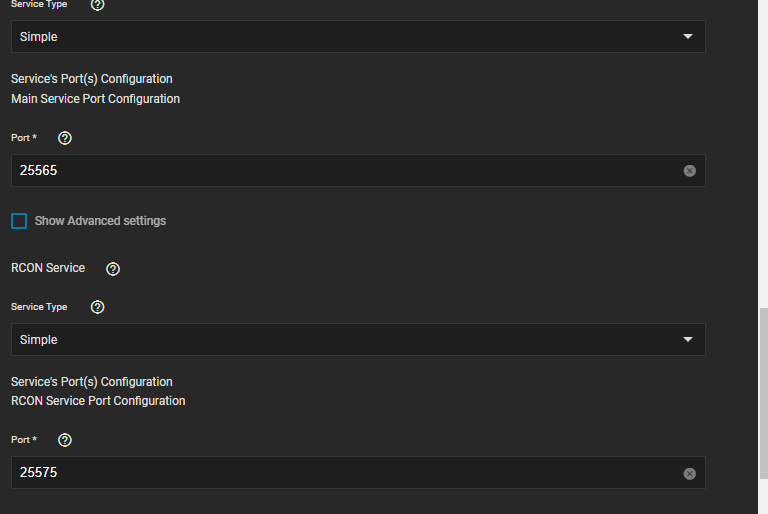
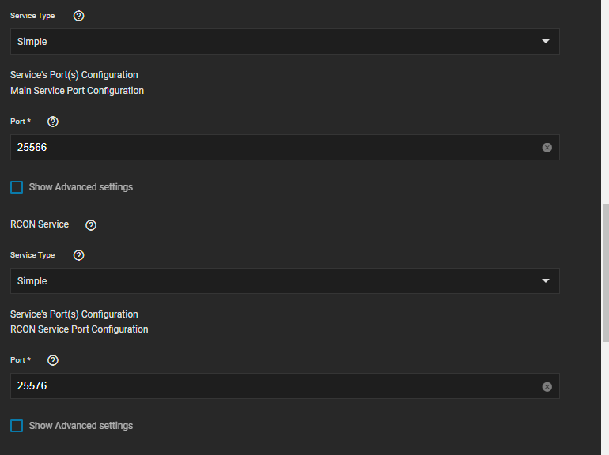

# Guide communautaire Minecraft Java

⚠️ **Avertissement Ce guide contient des informations qui utilisent les paramètres Avancé/Expert. En conséquence, cela sera en dehors de la portée du support !**⚠️

---

## Exécuter plusieurs serveurs MC-Java

Vous pouvez facilement exécuter plusieurs serveurs MC. Vous devez simplement modifier les ports externes, assurez-vous d'utiliser un port inutilisé. Il n'est pas nécessaire de modifier le port Minecraft ou le port RCON dans le fichier server.properties

Serveur MC 1

Serveur MC 2

## Plugins DIR

Pour obtenir facilement des plugins sur votre serveur MC puisque les PVC sont utilisés pour le stockage de la configuration, vous pouvez ajouter un chemin de stockage pour /mods ou /plugins selon ce dont votre serveur a besoin

Cela vous donnera un dossier facile à déposer dans les plugins et ils seront ensuite synchronisés avec /data/plugins ou /data/mods , vous devrez/pourriez avoir besoin de se connecter à l'application pour nettoyer périodiquement les anciennes versions

## Plugins/mods nécessitant des ports supplémentaires

Utiliser Dynmap comme exemple sous réseau et Services Check Show Expert config (souvenez-vous de l'avertissement en haut ?)

Cliquez sur Configurer ajouter des services manuels personnalisés et remplissez comme vous le souhaitez, donc aussi ajouter des ports de service supplémentaires

Pour la seconde instance de serveur, la configuration est à peu près la même différence mineure est le besoin de changer le port pour dynmap dans le conteneur pour un nouveau port et de le configurer comme ainsi (Notez que cela pourrait être mon système simplement stupide à cause de mes tests et pas de redémarrage)

Dynmap Web working

