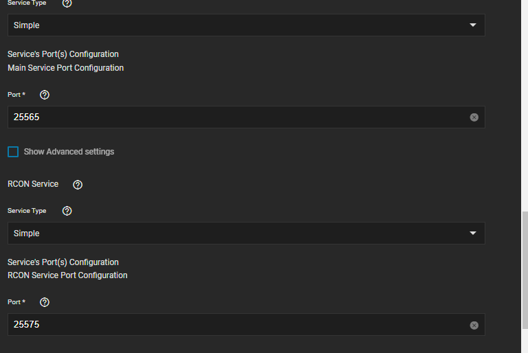
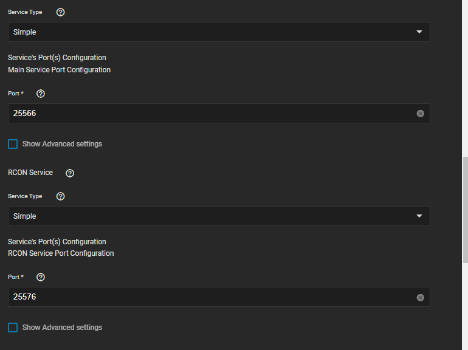
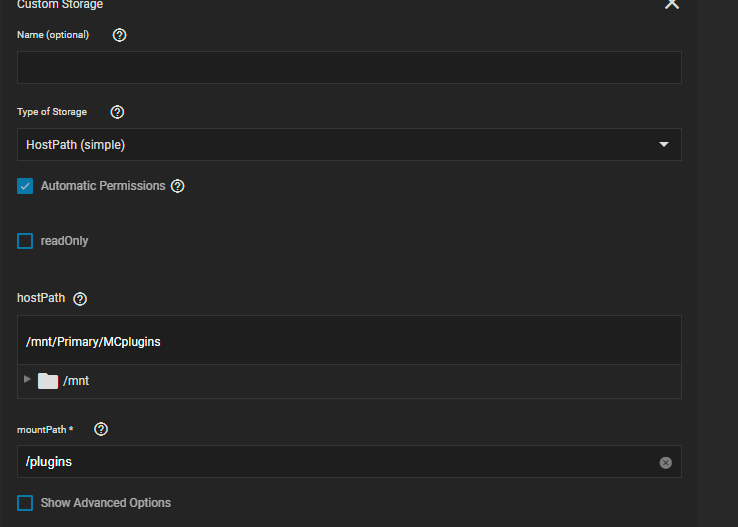
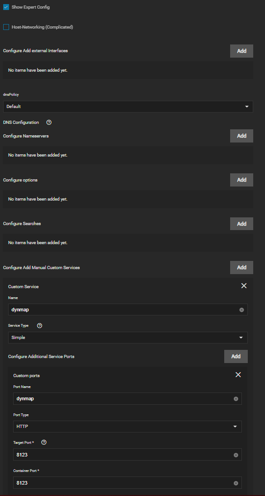
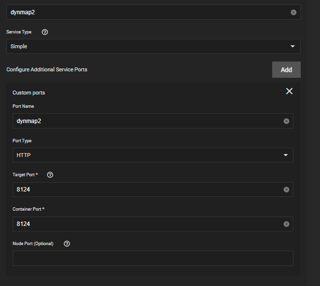
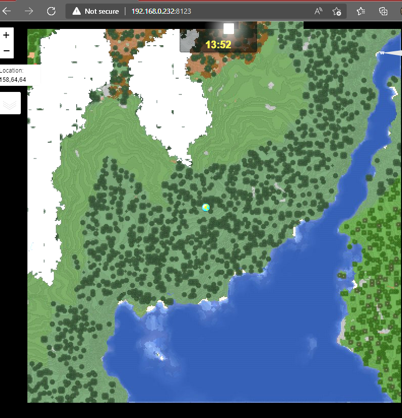

# Minecraft Java 社区指南

⚠️ **警告本指南包含使用高级/专家设置的信息。 结果，这将超出支持范围！** :warning_selector：

---

## 运行Multiple MC-Java 服务器

您可以轻松运行多个MC服务器。 您只需更改外部端口。请务必使用一个未使用的端口。 无需更改服务器上的 Minecraft 端口或 RCON 端口。

MC 服务器 1

MC 服务器 2

## 插件 DIR

为了方便地获取插件到您的MC服务器，因为PVC正在用于配置存储，您可以根据您的服务器需要添加一个主机路径存储器/mods或/plugin。

这将使你有一个容易丢弃插件的文件夹，然后他们会同步到 /data/plugins 或 /data/mods ， 您将/可能需要填充到应用程序以定期清理旧版本

## 需要额外端口的插件/模组

使用Dynmap 作为示例在网络和服务下检查专家配置 (在顶部记住警告？)

单击配置添加手动自定义服务并填充类似于添加附加服务端口

对于第二个服务器实例，设置的一个小的区别是需要将容器中的dynmap 端口更改为一个新端口并进行类似的配置(注意这可能只是我的系统由于我的测试而默默默无闻，而不是重启)

Dynmap 网页工作

