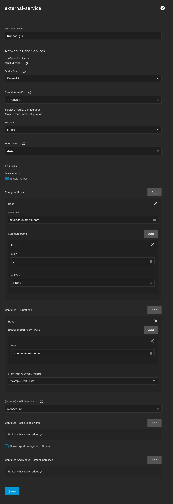

# TrueNAS Web GUI 通过 Traefik 在端口 443

如果您遵循了 `11中的指令，则在端口 80/443 上暴露Traefik` `快速启动指南`, 您的TrueNAS Web GUI现在将在自定义端口上服务(视频指南中的端口81和444)。

如果您不想使用这些自定义端口访问TrueNAS Web GUI， 您可以遵循指南 `16 - 设置外部服务` 以通过 Traefik 访问TrueNAS Web GUI 端口443。

设置 `外部服务` 时：

- 将 `外部服务 IP` 设置为您的TrueNAS 服务器的IP地址
- 将 `端口类型` 设置为 `HTTPS`
- 将 `服务端口` 设置为 `网络接口HTTPS 端口` 设置为 TrueNAS GUI (`444` 如果您遵循指南11)
- 根据指南12设置 `主机` 和 `主机名` 值为 truenas.example.com

现在Traefik将通过 HTTPS 在 truenas.example.com 上为TrueNAS Web GUI 服务。 请确保您的 DNS 指向您的TrueNAS 服务器的IP地址的 truenas.example.com 。

若要检查您是否正确设置了一切，请将您的设置与此屏幕截图中的设置比较：

一旦您的外部服务部署，您可以从外部服务菜单中选择"编辑"(三点)来获取此概览。
