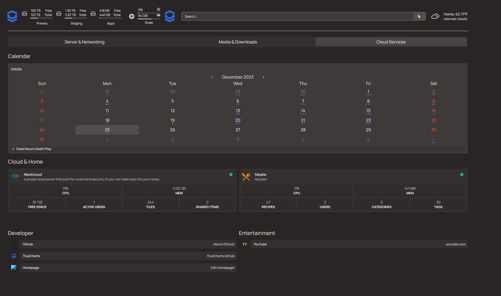

We are happy to announce that we have completed adding the integration of Homepage in to our charts

When you enable integrations for Homepage in your application deployment. and install Homepage. you can follow our guide [Homepage guide](https://truecharts.org/charts/stable/homepage/) to enable k8s support in homepage. with this you will be able to see your applications and their status in a customizable dashboard that you can organize and and arrange the applications using the code-server addon to edit the various yaml files

Don't forget to checkout the Homepage project site [homepage](https://gethomepage.dev)

Here's a small example with a mix of manually defined and TrueCharts integration options for Homepage 

