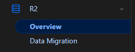
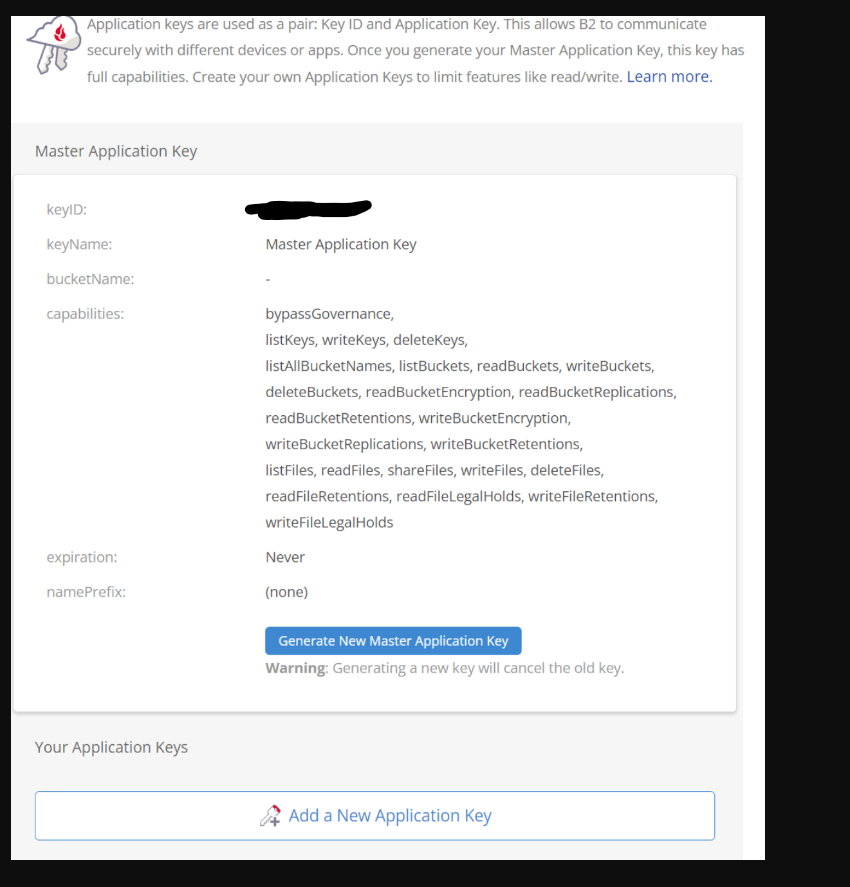

:::caution[WIP]

We're completely reworking the way we handle backups, moving away from platform-specific solutions to a "one size fits everyone" system using VolSync and CNPG backups.
We're also making it known that the old guide will not work on TrueNAS SCALE 24.04.X "DragonFish"

:::

:::caution[Best Effort Policy]

This guide has been written with the best efforts of the staff and tested as best possible. We are not responsible if it doesn't work for every scenario or user situation.

:::

## Requirements

### System Apps

We expect users to have fully followed the SCALE quick-start [guide](/scale) and hence have installed *all* [operators](/scale/#minimal-getting-started-setup-with-scale) from the `system` train as listed there. This includes `VolSync`, the latter of which depends on `Prometheus-Operator`, so ensure you have installed this first prior to installing VolSync.

### S3 Backup Provider

Our only officially supported system for "offsite" backups is S3(-compatible) storage. Offsite can be either another machine with minio or a S3 Storage provider like [BackBlaze](https://www.backblaze.com/) or [AWS](https://aws.amazon.com/s3/pricing/). Currently our only officially supported backup providers are [Cloudflare](https://www.cloudflare.com/de-de/developer-platform/r2/) and [BackBlaze](https://www.backblaze.com/), but we're looking forward to expanding this list in the future.
Both Cloudflare and BackBlaze provide a free plan with 10GB of storage included.

## Backup

### Obtaining S3 credentials

#### Cloudflare

- Login into your cloudflare account and go to the R2 section seen below:
  
- You might need to agree to the Terms for the R2 Storage
- Click on "Manage R2 API Token" as highlighted in the picture below.
  

- Click on "Create API token" in the top right corner. Name it to your liking.
- Give "Admin Read & Write" Permissions and click on "Create API token" in the bottom right
- It now shows you an screenshot with your S3 Credentials like this:

:::caution[Credentials]

Note down your Credentials as they are only shown once!

:::

##### Cloudflare Credentials assignment for Scale
- Access Key ID -> accessKey
- Secret Access Key -> secretKey
- endpoint, default -> url

#### Backblaze 
- Create new Application Key:
  
- Allow access to all buckets aswell as "Read and Write Access" and give it a meaningful name.

- Note down the shown credentials
  
:::caution[Credentials]

Note down your Credentials as they are only shown once!

:::

##### Backblate Credentials assignment for Scale
- keyID -> accessKey
- applicationKey -> secretKey 

#### Storj 
- Go to Access Keys of your storj project
- Create new access key, give it a name, and select S3 Credential
- Select Advanced to only give access to a specific bucket (optional). Otherwise, select Full Access.
  
- Select all permissions (maybe it will work with just read and write)
- Select the bucket where you want to store the backups
- Select No Expiration
- click Create Access
  
:::caution[Credentials]

Note down your Credentials as they are only shown once!

:::

##### Storj Credentials assignment for Scale
- storj Access Key -> accessKey
- storj Secret Key -> secretKey 
- https://gateway.storjshare.io/ -> url

### General Configuration Steps

:::caution[Credentials]

Do not add the credentials inside the VolSync Chart. This wont work and they need to be added to each chart individually.

:::

- Enter your S3 credentials under `credentials` in each app you want to backup/restore.
  

### Exporting App Configuration

To be done. This section will contain information to export your App configuration so it can be imported later.

### PVC Backups

PVC data can be easily backed-up to S3 storage by using our integrated `VolSync` support.

For each individual App, Destination (automatic restore) *must* set on creation of the App by doing the following:

- Add `VolSync` to each persistence object you want synced. Like this
  
- Add the name you gave to the S3 credentials under the `credentials` section of VolumeSnapshots
- Enable `source` (backup) and/or `destination` (automatic restore)
- Confirm the data is being sent to your S3 host after ~5 minutes

**Note: You do not have to manually create the bucket beforehand, although this is recommended to ensure the bucket-name is available beforehand**

### CNPG Database Backups

CNPG-backed PostgreSQL databases have their own S3 Backup system. We have integrated it in such a way that they can safely share a bucket with the above PVC backups.

For each App:

- Add CNPG backups to each database you want backed up like shown below.
- Add the name you gave to the S3 credentials under the `credentials` section
- Confirm the data is being sent to your S3 host after ~5 minutes
- We advise you to set the "mode" to `restore`, this at should prevent the app starting with an empty database on restore.
  

## Restore

### Importing App Configuration

To be done. This section will contain information to import your App configuration so you do not have to manually recreate it.

### Recreating an App

When you've no exported app configuration, you can remake the app while also restoring your PVC and CNPG backups using the steps as follows:

- Ensure the app name matches the name of the app previously backed-up
- Enter the same S3 credentials under the `credentials` section
- Preferably ensure all other configuration options are setup precisely the same as the last time you used the app

### PVC data Restoration

PVC data restoration will happen automatically before the app will start. Please be aware this can take a while depending on the size of the backup, your connection speed, etc.

### CNPG Database Restore

Before CNPG will correctly restore the database, the following modifications need to be done after recreating or importing the app configuration:

- Ensure you setup CNPG backups as well as restore as it was previously
- Ensure "mode" is set to `recovery`
- Set "revision" on your restore to match the previous **revision** setting on your backup setting
- Increase the **revision** on your backup setting by 1 (or set to 1 if previously empty)

### Total System Restore and Migration to New System

When on a completely new system, you can easily restore using the above steps with the following caveats:

- On a non-SCALE system, the PVC backend needs to support snapshots
- The Apps need to be called **PRECISELY** the same, preferably using a previously-exported config
- If you've any non-PVC storage attached, be sure that this is still available or Apps won't start until this is resolved

## Video Guide

TBD
