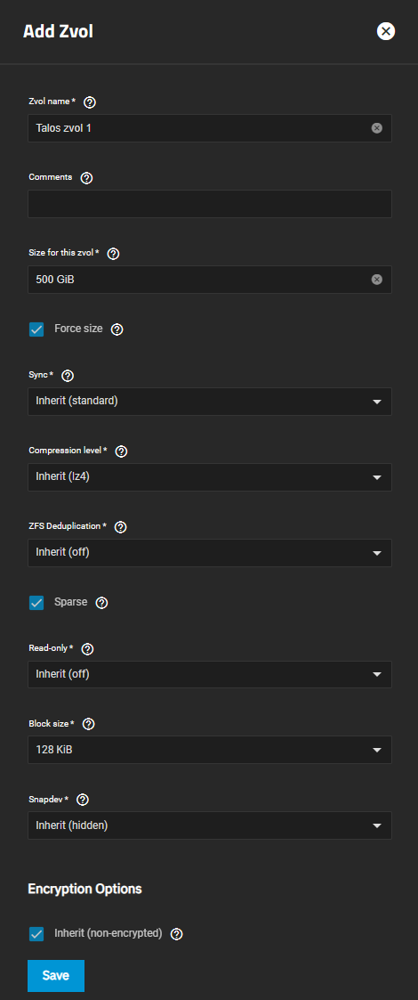
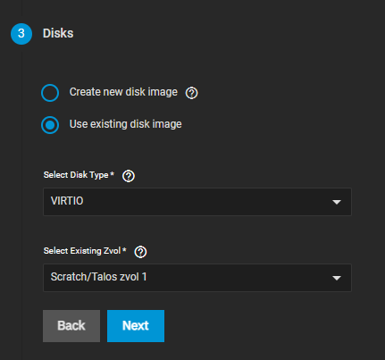

## Creating a Network Bridge

A network bridge will be needed for running a VM inside of SCALE and to be able to reach the SCALE host-machine. To create a Bridge network, open your TrueNAS Scale WebUI and go to the Network tab.

:::caution[Network]

Do not click `Test Changes` before you finish the whole guide

:::

### Acquiring Interface Settings

1. Note down the interface IP Address and the Subnet mask of your currently used interface.

2. Click on `Edit` on the currently used interface

3. Disable "DHCP" and remove all "Aliases" by clicking on the x next to them

4. Create the Network Bridge as described in the following section

The Network Interface should then look like this:


### Creating the Network Bridge

1. Click on `Add` in the top-right corner of the interfaces section

2. Select the type `Bridge` and give it a Name. Note that this name **cannot** be changed afterwards, so you might want to add a meaningful description to it

3. Add your network interface as a Bridge Member. (In this example: enp6so)

4. Set the `MTU` to "1500"

5. In the Alias section, click on `Add` to create a new IP address field

6. Enter the IP address and Subnet mask you previously took note of

7. Click `Test Changes` and confirm the prompt. Wait a bit for the UI to become responsive again

8. Click on `Save Changes` to save the changes you have made


9. If something goes wrong and the UI stays unresponsive,, the changes will be reverted after 60 seconds

The bridge should now look similar to this one when done:


## Creating the ZVOL storage for the VM

1. Start by going to the `Datasets` section of your TrueNAS Scale WebUI

2. The size should be between `500GiB` and `1000GiB`

3. Make sure to select the `Sparse` option

4. We do **not** recommend to encrypt the dataset

5. Set the block size to `128KiB`

6. After you are done it should look similar to this:



## Creating the VM

1. Start by going to the `Virtualization` section of your TrueNAS Scale WebUI

2. If you want to assign a GPU to the VM, make sure to [isolate](#gpu-isolation) the GPU first

3. Click on `Add Virtual Machines`

4. We also highly suggest users to set a [fixed DHCP-Lease](#fixed-dhcp-lease) (aka static IP) for your VM inside your modem/router.

### Operating System

Select the options like shown below:

Make sure to remember the password you have selected


### CPU And Memory

1. Select the amount of `Cores` and set the `Threads` to `2` if your CPU supports HyperThreading like in the example below. We suggest you to add available Host-Cores minus 1 for your host system.

2. Make sure to allocate enough `RAM` towards your VM with the `Memory Size` setting

Minimum Amount of RAM: `8GB`

Minimum Recommended Amount of RAM: `16GB`


### Disks

Select the previously created ZVOL for your VM as shown below:



### Network Interfaces

Change the `Attach NIC` to the Bridge you created in the beginning of the guide


### Installation Media

1. Download the Talos Linux Image [here](https://github.com/siderolabs/talos/releases/download/v1.7.0/metal-amd64.iso) and save it to your PC

2. Click on `Upload New Image File` in the VM Creation Screen and choose `Choose File` and select the downloaded ISO. Make sure to select a location _on your SCALE host_ where you want to save your ISO to. An example can be seen below:


### GPU

Make sure your GPU is [isolated](https://www.truenas.com/docs/scale/scaletutorials/systemsettings/advanced/managegpuscale/) before you try to assign it to your VM. If you don't want to assign a GPU to your VM, just click `Next` and skip this part of the guide.


### Confirm Options

If you followed this guide correctly, the options shown should look similar to the screenshot below. Make sure everything is correct and then click on `Save` to finish the VM setup.


## GPU Isolation

1. Go to `System Settings` > `Advanced` in your SCALE UI and scroll down to the section `Isolated GPU Device(s)`

2. Click on `Configure` on the top right of the section and close the warning

3. Select the GPU you want to Isolate and use for your VM in the dropdown. Like shown here


4. Click `Save`. This might take a bit

5. It should now show your isolated GPU in the section. You may need to hard-refresh your browser's page with CTRL + F5 for it to update due to SCALE GUI issues.

## Fixed DHCP Lease

Below you can find 2 examples on how to set a fixed DHCP Lease for UniFi and Fritzbox hardware.

### UniFi

1. Open your UniFi UI and go to the Client View (highlighted in blue on the screenshot)

2. Click on the Client that represents your VM (not your SCALE Host System)

3. Select `Fixed IP-Address` in the pop-up menu on the right, enter the IP address you'd like to reserve for the VM, and hit `Apply Changes`. Note that you will need to restart the VM from within SCALE to get it to update its IP address if you changed it.


### FritzBox

1. Go to your FritzBox web-interface. Navigate to `Home Network`> `Network` and select the running VM (not your SCALE Host System).

2. Click on the `Edit` button and scroll down to the IP-Address in Home Network section.

3. Check `Always give this device the same IP`


(screenshot in german)

## TalConfig Examples

Here are a few examples you can copy-paste into talconfig to setup the above VMs to run Talos.

### Single-Node Cluster or Master-Node

By default we ensure qemu guest additions are always loaded for all master-nodes.
It's important to note that for master nodes, we use static IPs for referencing them *after* they are initially initialised using a Fixed DHCP lease.


```yaml
    - hostname: k8s-control-1
      ipAddress: ${MASTER1IP}
      controlPlane: true
      nameservers:
        - 8.8.8.8
        - 1.1.1.1
      installDiskSelector:
        size: <= 100TB
      networkInterfaces:
        - interface: eth0
          addresses:
            - ${MASTER1IP}/24
          routes:
            - network: 0.0.0.0/0
              gateway: ${GATEWAY}
          vip:
            ip: ${VIP}
```

### Worker Node

By default we ensure qemu guest additions are always loaded for all worker-nodes.
Workernodes can be pretty basic and should "just work"

```yaml
    - hostname: k8s-worker-1
      ipAddress: 192.168.10.111
      nameservers:
        - 8.8.8.8
        - 1.1.1.1
      installDiskSelector:
        size: <= 600GB
```