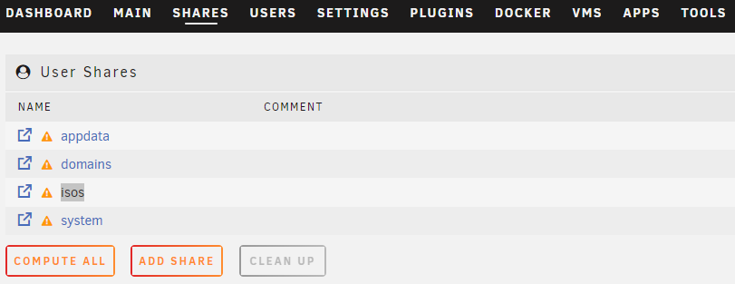
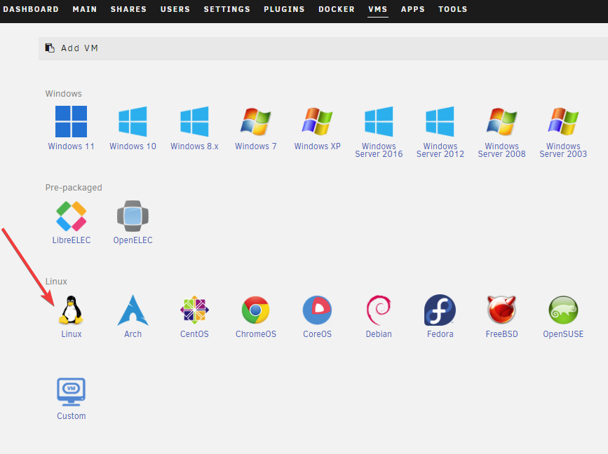
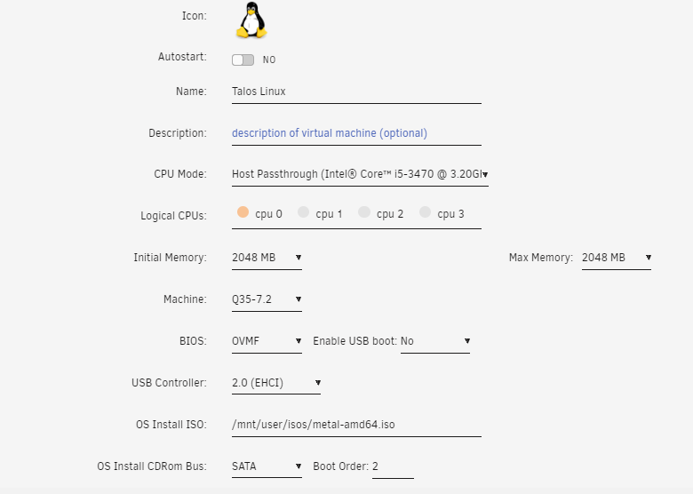
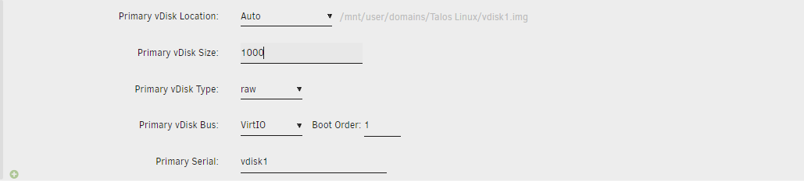
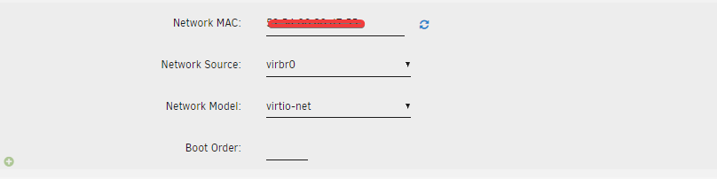

## Downloading Talos

1. Obtain the Talos ISO [here](https://github.com/siderolabs/talos/releases/download/v1.7.0/metal-amd64.iso) by pasting the link into your web browser.

2. Once download copy the isos into the `shares folder`;

    

## Creating the VM

1. Start by clicking the `Add VM` button under the VM Tab;

    

2. Now click the `Linux` button;

  

2. Supply a name for your new VM;

3. Edit memory to supply at least a minimum memory value of 8192 with the recommended value being 16384 or more;

4. select the OS install iso by select the ios was download before `Talos ISO image`;

  

4. Set the `disk space` to 500GB or 1000GB. Keep the remainder as the default.

    

5. Once the VM has been created select the VM and then settings.

    

7. For the `Network Source` section virbr0:

    

8. Now click the Create
