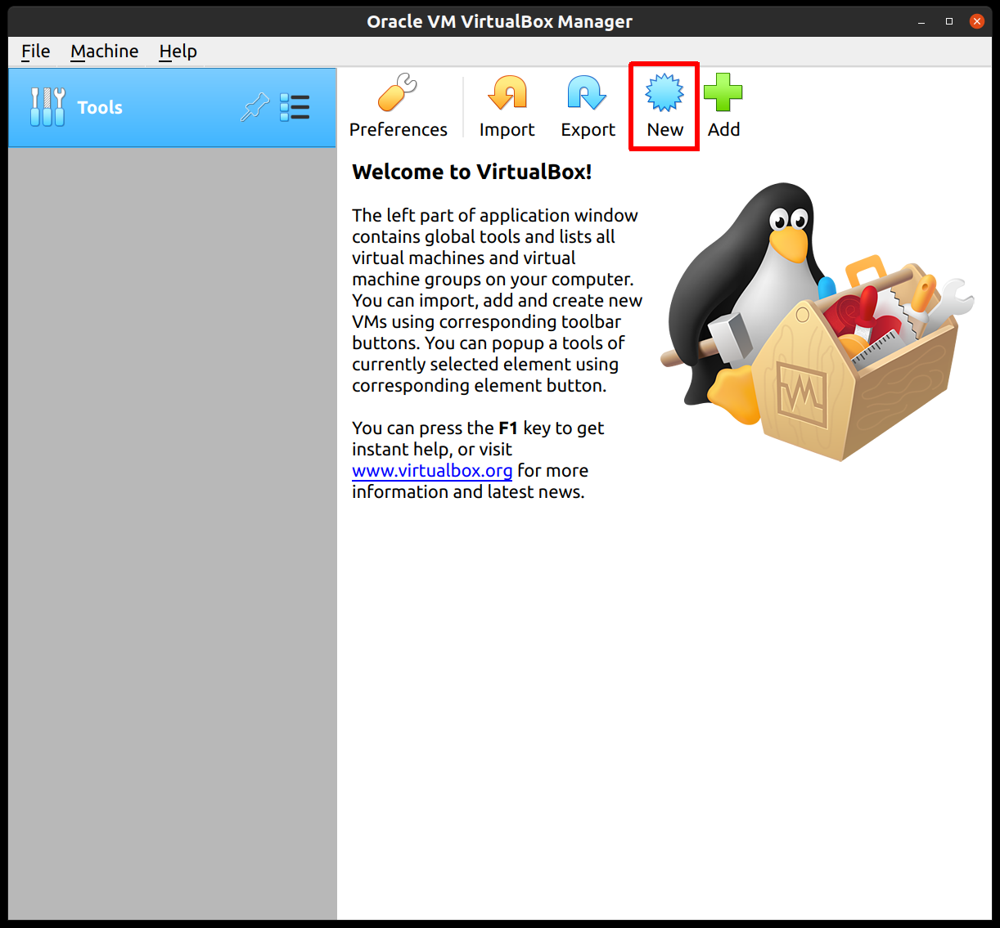
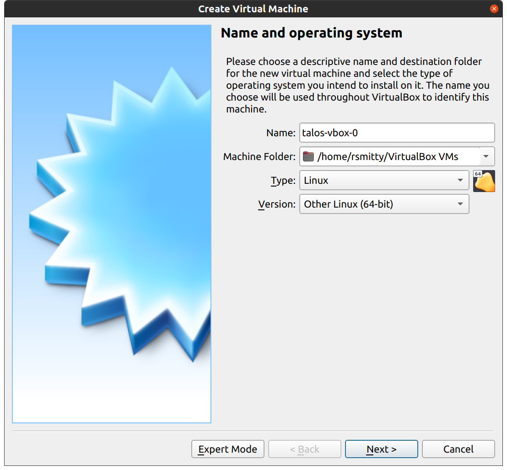
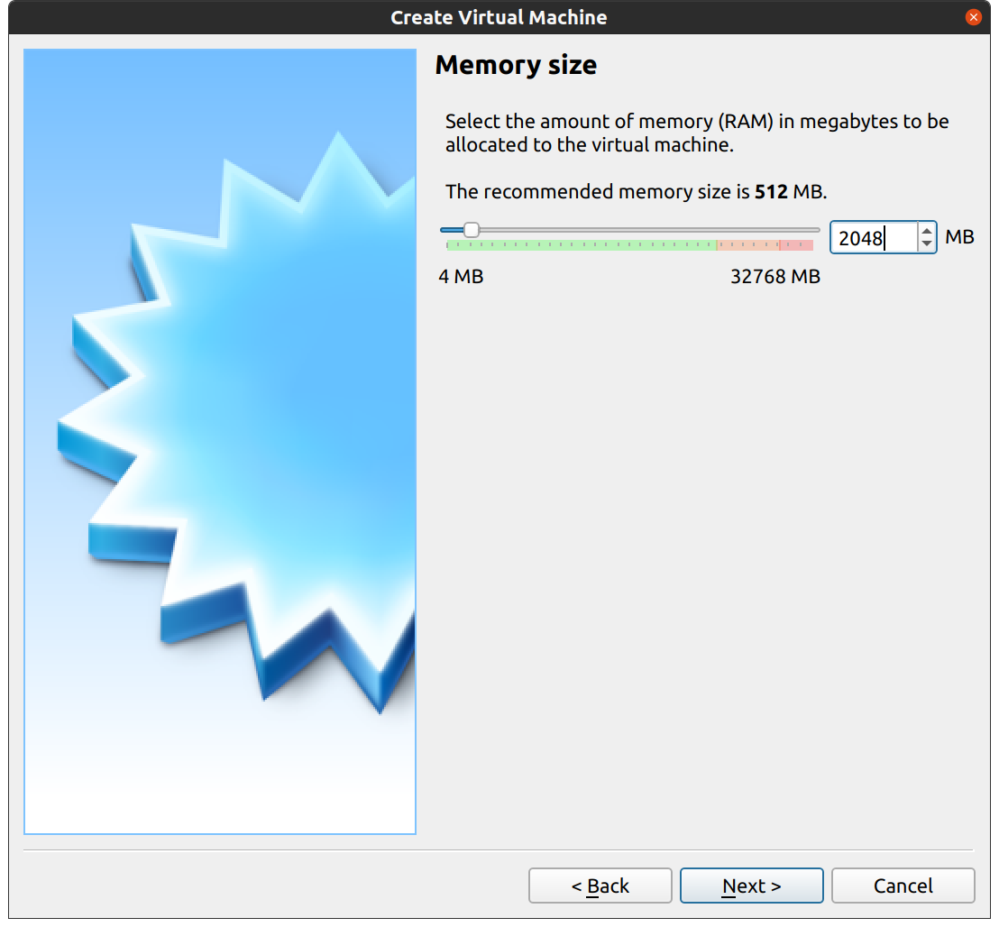
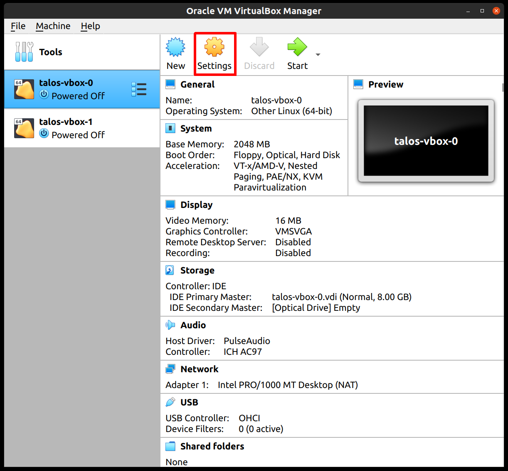
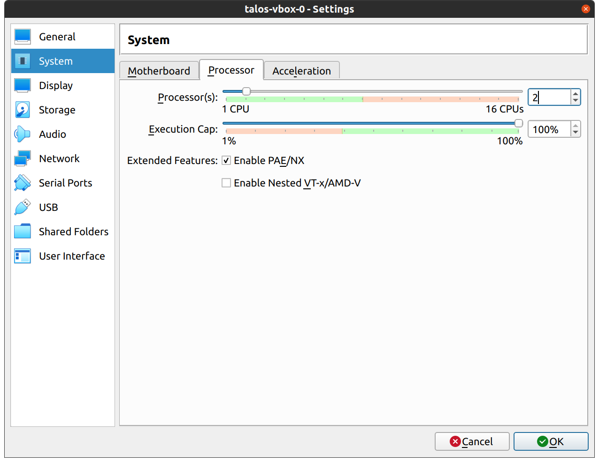
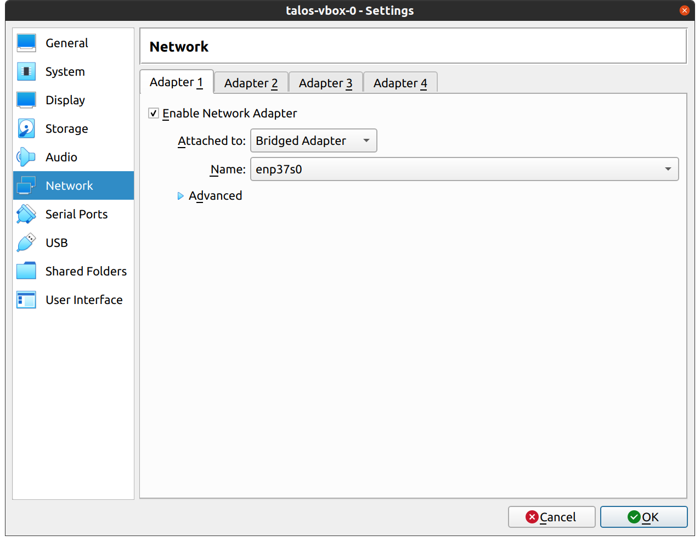
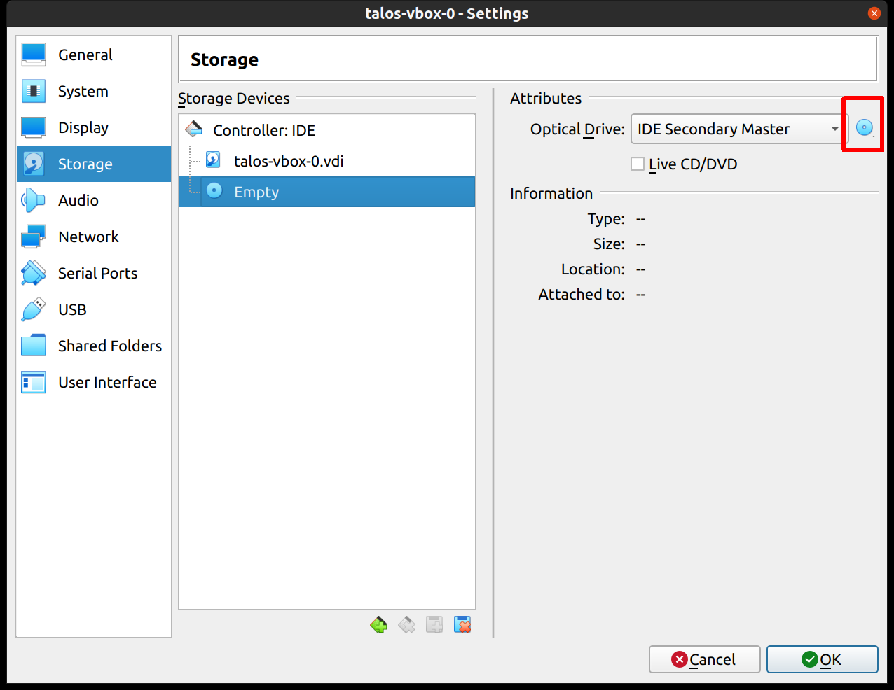

## Downloading Talos

1. Obtain the Talos ISO [here](https://github.com/siderolabs/talos/releases/download/v1.7.0/metal-amd64.iso) by pasting the link into your web browser.

## Creating the VM

1. Start by creating the `New` button in the VirtualBox UI;

    

2. Supply a name for your new VM, specifying type and version:

    

3. Edit memory to supply at least a minimum memory value of `8192` with the recommended value being `16384` or more.

    

4. Set the disk space to `500GB` or `1000GB`. Keep the remainder as the default.

5. Once the VM has been created select the VM and then settings.

    

6. In the system section, supply `1` core for the host system with the remainder allocated to the vm i.e. for in a six core system select `5`.

    

7. For the `Network` section switch the network `Attached To` section to `Bridged Adapter`:

    

8. In the `Storage` section, select the optical drive and on the right, select the ISO you downloaded earlier by browsing your filesystem.

    
