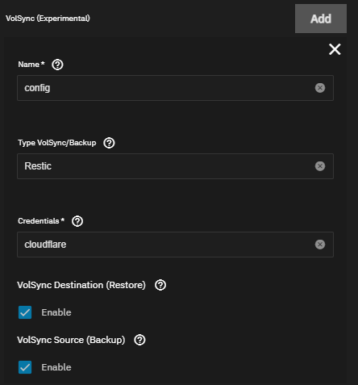

:::caution[The below is a work in progress]

We've recently completely reworked the way we handle backups, moving away from platform-specific solutions to a "one size fits everyone" system using VolSync and CNPG backups. We're also making it known that the prior version of this guide will **not** work on TrueNAS SCALE 24.04.X "DragonFish". This updated guide has been written with the best efforts of the staff and tested as best possible. We are not responsible if it doesn't work for every scenario or user situation.

:::

## Requirements

### System Apps

As this is a SCALE-specific guide, we expect users to have fully followed the SCALE quick-start [guide](/deprecated/scale) and hence have installed _all_ [operators](/deprecated/scale/#minimal-getting-started-setup-with-scale) from the `system` train as listed there. This includes `VolSync`, which depends on `Prometheus-Operator`, so ensure you have installed `Prometheus-Operator` prior to installing `VolSync`.

### S3 Provider Setup

See [here](/general/guides/s3-setup) for instructions on how to setup an S3 storage provider for use. Once this is done, return here and continue with the below.

## Backup Configuration

:::caution[Credentials]

Do not add the credentials inside the VolSync chart. This won't work as they need to be added to each chart individually.

:::

Enter your S3 credentials under the `credentials` section in each app you want to enable backup/restore functionality on.

### PVC Backups

PVC data can be easily backed up to S3 storage by using our integrated VolSync support. For each individual app, the `VolSync Destination (Restore)` option _must_ set on creation of the app by doing the following:

1. Add `VolSync` to each persistence object you want synced as below

2. Add the name you gave to the S3 credentials earlier, under the `credentials` section of VolumeSnapshots

3. Enable the `VolSync Source (backup)` and/or `VolSync Destination Restore)` options as desired

4. Confirm the data is being sent to your S3 host after ~5 minutes

:::note[Bucket Creation]

You do not have to manually create the bucket beforehand, although this is recommended to ensure the bucket's name is available beforehand.

:::

### CNPG Database Backups

CNPG-backed PostgreSQL databases have their own S3 backup system. We have integrated it in such a way that they can safely share a bucket with the above PVC backups.

For each app:

1. Add CNPG backups to each database you want backed up like shown below

2. Add the name you gave to the S3 credentials earlier, under the `credentials` section

3. Confirm the data is being sent to your S3 host after ~5 minutes

4. We advise you to set the "mode" to `restore`, this should prevent the app starting with an empty database upon restore.

#### Exporting App Configuration

To be done. This section will contain information to export your App configuration so it can be imported later.

## Restoration Configuration

:::note[SCALE Restore Functionality]

As mentioned in our news post, this new restore functionality isn't yet functional on TrueNAS SCALE due to an [upstream bug](https://github.com/openebs/zfs-localpv/issues/536) with OpenEBS. We've submitted a bug report and will update this page once resolved.

:::

### Recreating an App

When you've no exported app configuration, you can remake the app while also restoring your PVC and CNPG backups using the steps as follows:

1. Ensure the app name matches the name of the app previously backed up

2. Enter the same S3 credentials from earlier, under the `credentials` section

3. Preferably ensure all other configuration options are set precisely the same as the last time you used the app, to ensure compatibility

### PVC data Restoration

PVC data restoration will happen automatically before the app starts. Please be aware this can take a while depending on the size of the backup, your connection speed, etc.

### CNPG Database Restore

Before CNPG will correctly restore the database, the following modifications need to be done after recreating or importing the app configuration:

1. Ensure you've setup CNPG backups as well as restore as it was previously

2. Ensure the "mode" is set to `recovery`

3. Set "revision" on your restore to match the previous **revision** setting on your backup settings

4. Increase the **revision** on your backup setting by 1 (or set to 1 if previously empty)

#### Importing App Configuration

To be done. This section will contain information to import your App configuration so you do not have to manually recreate it.

## Total System Restore and Migration to New System

When on a completely new system, you can easily restore using the above steps with the following caveats:

- On a non-SCALE system, the PVC backend needs to support snapshots
- The apps need to be called **exactly** the same as they were before, preferably using a previously-exported config
- If you've any non-PVC storage attached, be sure that this is still available or apps won't start until this is resolved

## Video Guide

TBD
