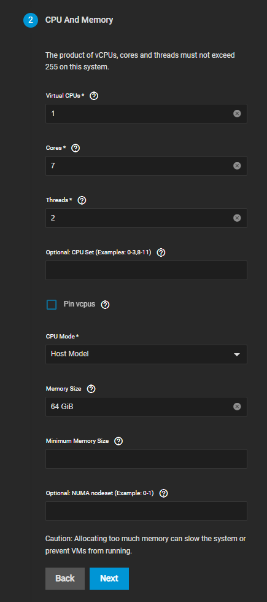
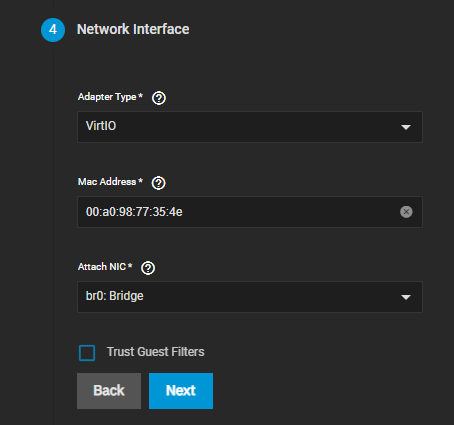

:::caution[Bridge]
Make sure that you have followed the [Bridge Guide](/deprecated/scale/guides/network-bridge/) and have setup your network bridge to be used for your VM.

:::

## Creating the ZVOL for the VM

1. Start by going to the `Datasets` section of your TrueNAS Scale WebUI.

2. The size should be between `500GiB` and `1000GiB.`

3. Make sure to select the `Sparse` option

4. We do not recommend to encrypt the dataset.

5. Set the block size to `128KiB`

6. After you are done it should look similar to this:
    

## Creating the VM

1. Start by going to the `Virtualization` section of your TrueNAS Scale WebUI.

2. If you want to assign a GPU to the VM, make sure to [isolate](#gpu-isolation) the GPU first. 

3. Click on `Add Virtual Machines`

### Operating System

Select the options like shown below:

Make sure to remember the password you have selected.

### CPU And Memory

1. Select the amount of `Cores` and Set the `Threads` to `2` if your CPU support HyperThreading like in the example below.
    We suggests you to add available Host-Cores minus 1 for your host system.

2. Make sure to allocate enough `RAM` towards your VM with the `Memory Size` setting.

    Minimum Amount of RAM: `8gb`
    Minimum Recommended Amount of RAM. `16GB`

### Disks

Select the previously created Zvol for your VM like shown below:

### Network Interfaces

Change the `Atach NIC` to the Bridge you have create in the [Bridge Guide](/deprecated/scale/guides/network-bridge/)

### Installation Media

1. Download the Talos Linux Image [here](https://github.com/siderolabs/talos/releases/download/v1.7.0/metal-amd64.iso) and save it to your pc.

2. Click on `Upload New Image File` in the VM Creation Screen and choose `Choose File` and select the downloaded ISO. Make sure to select an location where you want to save your ISO to. An example can be seen below:

    

### GPU

Make sure your GPU is isolated before you try to assign it towards your VM.
If you don't want to assign a GPU to your VM just click `Next` and skip this part of the guide.

### Confirm Options

If you followed this guide closely the options shown should look similar to the screenshot below.
Make sure everything is correct and then click on `Save` to finish the VM settings.

## GPU Isolation:

1. Go to `System Settings` > `Advanced` in your SCALE UI and scroll down to the section `Isolated GPU Device(s)`.

2. Click on `Configure` on the top right of the section and close the warning.

3. Select the GPU you want to Isolate and use for your VM in the dropdown. Like shown here
    

4. Click `Save`. This can take a bit.

5. It should now show your Isolated GPU in the Section. (Might need to refresh and clear your cache for it to show up.)