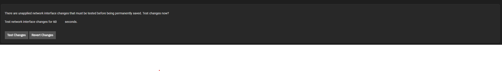
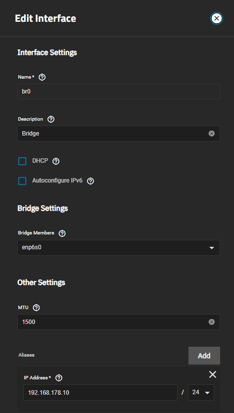

A network bridge will be needed for running a VM inside of SCALE and to be able to reach the host-machine.
To create a Bridge. Open your TrueNAS Scale WebUI and go to the Network tab.

:::caution[Network]

Do not click `Test Changes` before you finished the whole guide.

:::

## Aquiring Interface Settings

1. Note down the interface IP Address and the Subnet mask of your currently used Interface. 

2. Click on Edit on the currently used Interface.

3. Disable `DHCP` and remove all `Alias` by Clicking on the x next to them.

4. Create the Network Bridge like described in the following section.

The Network Interface should now look like this:

## Creating the Network Bridge

1. Click on Add in the Top Right Corner of the Interfaces Section.

2. Select Type Bridge and give it a Name. The name cannot be changed afterwards. You might want to add a meaningful description to it.

3. Add your network interface as a Bridge Member. (Example here: enp6so)

4. Set the `MTU` to `1500`.

5. In the Alias section click on Add to create a new IP Address Field.

6. Enter the IP-Address and Subnet mask you previously took note off.

7. Click `Test Changes` and confirm the prombt. Wait a bit for the ui to get responsive again.

8. Click on `Save Changes` to save the changes you have made.

9. If something goes wrong and the UI stays unresponsive the changes will be reverted in 60 seconds.

The bridge should look similar to this one when done:

