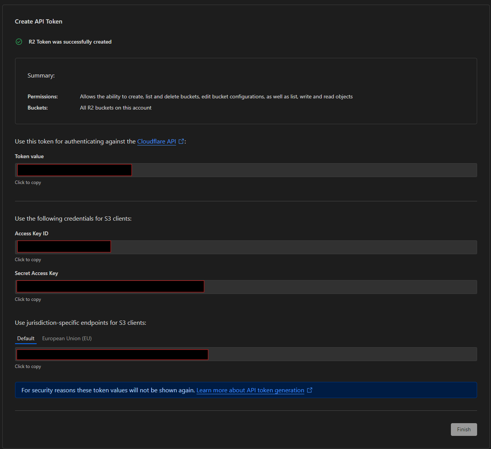
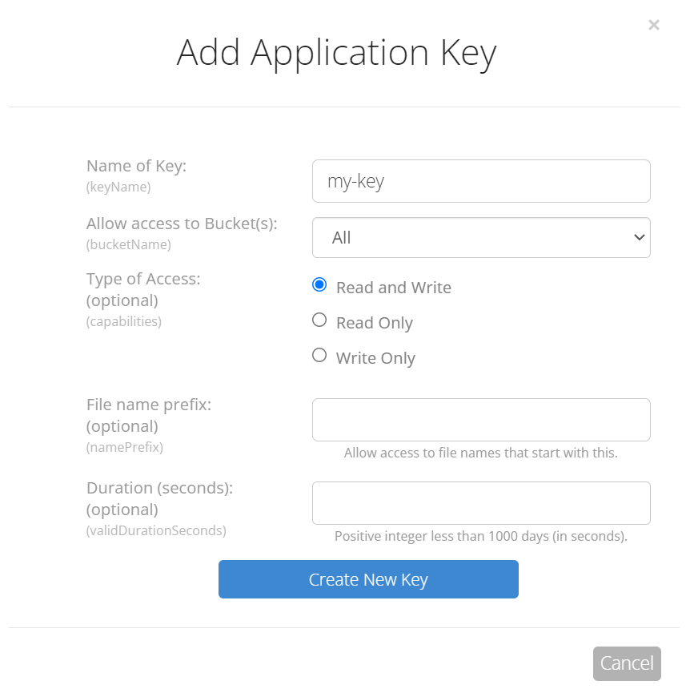
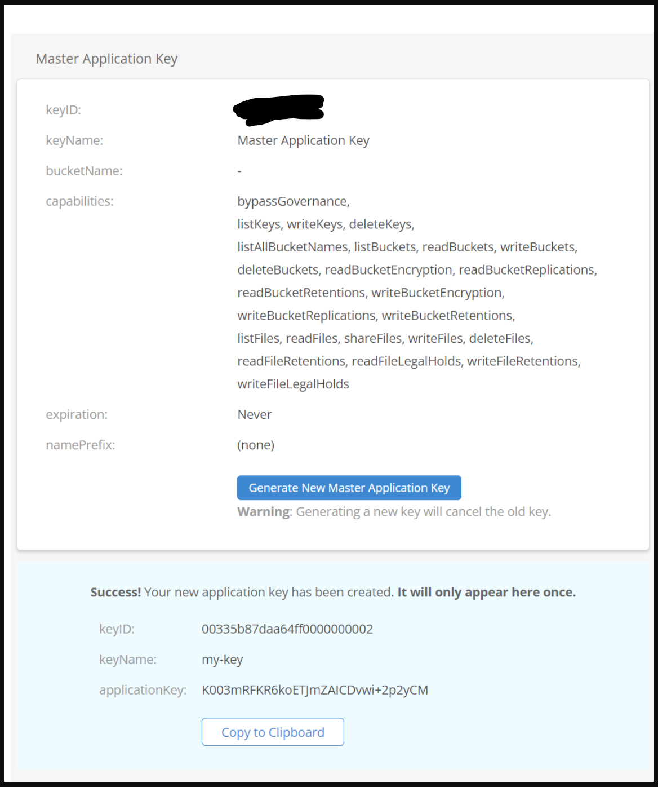
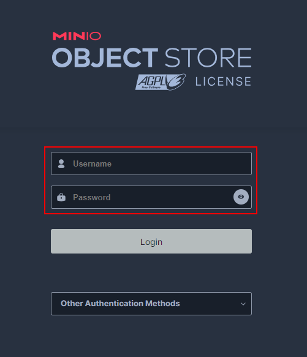
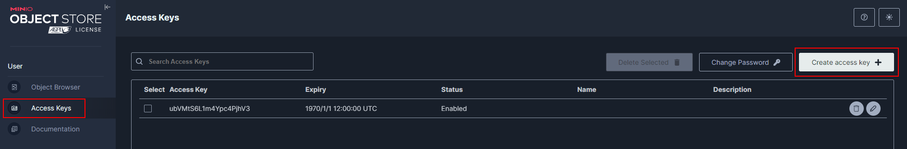
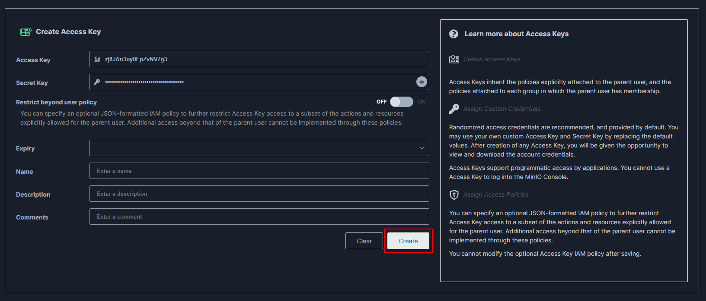
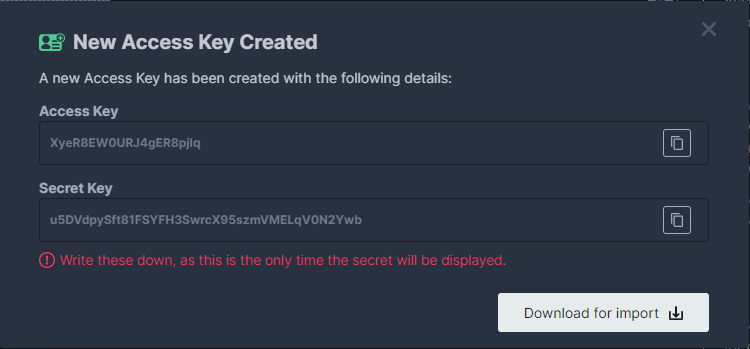

The below outlines how to setup an S3 storage provider for use with TrueCharts.

## S3 Backup Providers

Our only officially supported system for "offsite" backups is S3(-compatible) storage. Offsite can be either another machine with running [MinIO](https://min.io/) or an S3 Storage provider like [BackBlaze](https://www.backblaze.com/docs/cloud-storage-s3-compatible-api), [CloudFlare](https://www.cloudflare.com/en-au/developer-platform/r2/), [Amazon](https://aws.amazon.com/s3/) (coming soon) and more. Currently our only *officially* supported backup providers are CloudFlare and BackBlaze, but we're working to expand this list in the future.

Both CloudFlare and BackBlaze provide a free plan with 10GB of storage included.

## Obtaining S3 credentials

### CloudFlare

1. Login into your CloudFlare account and go to the R2 section seen below, you might need to agree to the Terms for the R2 Storage

2. Click on "Manage R2 API Token" as highlighted in the picture below

3. Click on "Create API token" in the top right corner and name it to your liking

4. Give "Admin Read & Write" Permissions and click on "Create API token" in the bottom right

5. It now shows you a screenshot with your S3 Credentials like this:

:::caution[Credentials]

Note down these credentials as they are only shown to you once!

:::

#### CloudFlare credentials assignment

- Access Key ID -> accessKey
- Secret Access Key -> secretKey
- endpoint, default -> url

### Backblaze

1. Create a new Application Key as below

2. Allow access to all buckets, give it "Read and Write Access" and give it a meaningful name

3. Note down the shown credentials

:::caution[Credentials]

Note down these credentials as they are only shown to you once!

:::

#### Backblaze credentials assignment

- keyID -> accessKey
- applicationKey -> secretKey

### Storj

- Go to Access Keys of your storj project
- Create new access key, give it a name, and select S3 Credential
- Select Advanced to only give access to a specific bucket (optional). Otherwise, select Full Access.

- Select all permissions (it might work with just read and write)
- Select the bucket where you want to store the backups
- Select No Expiration
- Click Create Access

:::caution[Credentials]

Note down your Credentials as they are only shown once!

:::

#### Storj Credentials assignment

- storj Access Key -> accessKey
- storj Secret Key -> secretKey
- https://gateway.storjshare.io/ -> url

### MinIO

1. Login into MinIO web interface.

2. Navigate to the "Access Keys" section and click "Create access key" as shown below.

3. Fill out the form if wanted or leave the form as it is and click on "Create" in the lower right corner.

4. If you want to store the generated credentials, click "Download for import" to store them to an .json file.

:::caution[Credentials]

Note down these credentials as they are only shown to you once!

:::

5. The API url can be found when starting the MinIO server

#### MinIO credentials assignment

- Access Key -> accessKey
- Secret Key -> secretKey
- API url -> url
